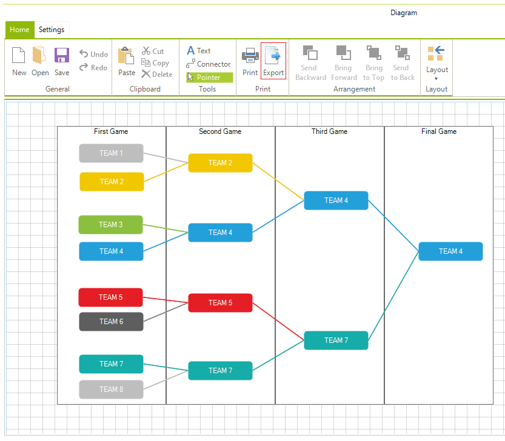
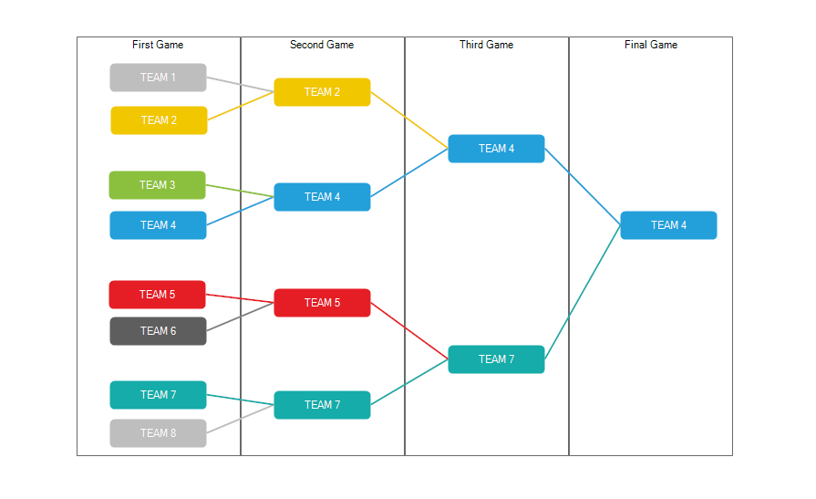

# Export

This article describes the __RadDiagram__ export to image feature.

The __RadDiagram__ framework provides a method for exporting its current state to an image file. You can control the type of the created image.

# ExportToImage method

The RadDiagram.__ExportToImage()__ method allows you to export the diagram to an image. It returns an Image which can be saved in the desired type.

{{source=..\SamplesCS\Diagram\DiagramItems.cs region=Export}} 
{{source=..\SamplesVB\Diagram\DiagramItems.vb region=Export}} 

````C#
Image img1 = this.radDiagram1.ExportToImage();
string imagePath1 = @"..\..\img1.png";
img1.Save(imagePath1);

````
````VB.NET
Dim img1 As Image = Me.RadDiagram1.ExportToImage()
Dim imagePath1 As String = "..\..\img1.png"
img1.Save(imagePath1)

````

{{endregion}} 

Alternatively, you can use the __RadDiagramRibbonBar__ and its *Export* button:



#### The exported image is illustrated below




