# Layout

Layout in the __RadDiagram__ refers to the way the __Shapes__ are arranged on the diagramming surface. __RadDiagram__ provides a dozen of layout algorithms which can be easily customized.

## Sugiyama Layout

The Sugiyama is a layered layout type which organizes a diagram in layers and attempts to minimize the amount of crossings between the connections and the layers.

Sugiyama is the default layout algorithm in __RadDiagram__. Using it is straightforward - just invoke the RadDiagram.__SetLayout()__ method or use the DiagramCommands.__Layout__:

* use the RadDiagram.__SetLayout__ method: 

{{source=..\SamplesCS\Diagram\DiagramItemsManipulation.cs region=SetLayout}} 
{{source=..\SamplesVB\Diagram\DiagramItemsManipulation.vb region=SetLayout}} 

````C#
this.radDiagram1.SetLayout(Telerik.Windows.Diagrams.Core.LayoutType.Sugiyama);

````
````VB.NET
Me.RadDiagram1.SetLayout(Telerik.Windows.Diagrams.Core.LayoutType.Sugiyama)

````

{{endregion}} 


* use the DiagramCommands.__Layout__: 

{{source=..\SamplesCS\Diagram\DiagramItemsManipulation.cs region=LayoutCommand}} 
{{source=..\SamplesVB\Diagram\DiagramItemsManipulation.vb region=LayoutCommand}} 

````C#
this.radDiagram1.DiagramElement.TryExecuteCommand(Telerik.WinControls.UI.Diagrams.DiagramCommands.Layout);

````
````VB.NET
Me.RadDiagram1.DiagramElement.TryExecuteCommand(Telerik.WinControls.UI.Diagrams.DiagramCommands.Layout)

````

{{endregion}} 
 
The __SetLayout__ method provides two optional parameters - the type of the Layout (Sugiyama or Tree) and the corresponding layout settings (SugiyamaSettings or TreeLayoutSettings): 

{{source=..\SamplesCS\Diagram\DiagramItemsManipulation.cs region=SugiyamaSettings}} 
{{source=..\SamplesVB\Diagram\DiagramItemsManipulation.vb region=SugiyamaSettings}} 

````C#
Telerik.Windows.Diagrams.Core.SugiyamaSettings settings = new Telerik.Windows.Diagrams.Core.SugiyamaSettings()
{
    HorizontalDistance = 50,
    VerticalDistance = 20,
    Orientation = Telerik.Windows.Diagrams.Core.Orientation.Horizontal,
    TotalMargin = new Telerik.Windows.Diagrams.Core.Size(20, 20),
    ShapeMargin = new Telerik.Windows.Diagrams.Core.Size(10, 10),
};
this.radDiagram1.SetLayout(Telerik.Windows.Diagrams.Core.LayoutType.Sugiyama, settings);

````
````VB.NET
Dim settings As New Telerik.Windows.Diagrams.Core.SugiyamaSettings() With { _
    .HorizontalDistance = 50, _
    .VerticalDistance = 20, _
    .Orientation = Telerik.Windows.Diagrams.Core.Orientation.Horizontal, _
    .TotalMargin = New Telerik.Windows.Diagrams.Core.Size(20, 20), _
    .ShapeMargin = New Telerik.Windows.Diagrams.Core.Size(10, 10) _
}
Me.RadDiagram1.SetLayout(Telerik.Windows.Diagrams.Core.LayoutType.Sugiyama, Settings)

````

{{endregion}} 


Below you can see how random shapes and connections are being arranged with the given layout configuration:
>caption Fig.1 Random generated shapes and connections

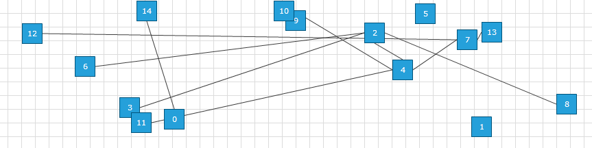
>caption Fig.2 Sugiyama layout

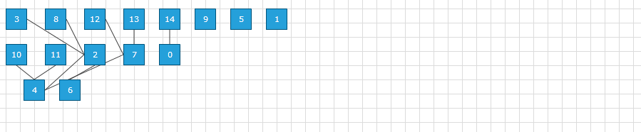

## Tree Layout

The Tree Layout Type organizes a diagram in a tree-like fashion. There are eight additional subtypes of Tree Layout:

* __Tree-down__: a standard hierarchical layout with node spreading from the root downwards.
            

* __Tree-up__: a standard hierarchical layout with node spreading from the root upwards.
            

* __Tree-left__: a standard hierarchical layout with node spreading from the root to the left.
            

* __Tree-right__: a standard hierarchical layout with node spreading from the root to the right.
            

* __Mindmap-vertical__: a classic mind mapping pattern with wings stacked vertically.
            

* __Mindmap-horizontal__: a classic mind mapping pattern with wings stacked horizontally.
            

* __Tip-over tree__: much like the tree-down layout but nodes are organized as standard trees from the first-child level on to reduce the spreading and usage of space.
            

* __Radial__: siblings are organized on circular level emanating from the center/root outwards.
            

Below you can see a snapshots of random diagrams laid out with Tree Layout types:

* __TreeLayoutType.TreeDown__:
 
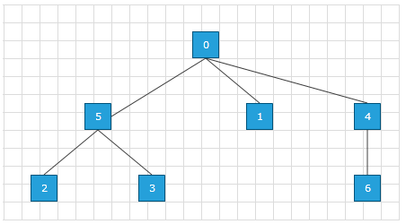

* __TreeLayoutType.TreeUp__:
            
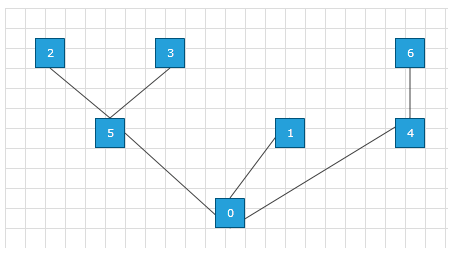

* __TreeLayoutType.TreeLeft__:
            
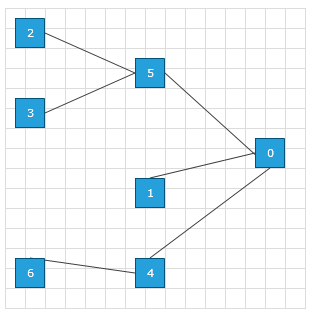

* __TreeLayoutType.TreeRight__:
            
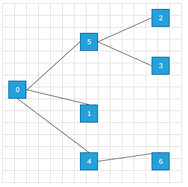

* __TreeLayoutType.MindmapVertical__:
            
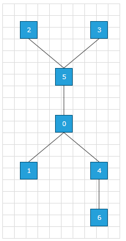

* __TreeLayoutType.MindmapHorizontal__:
            
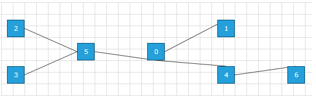

* __TreeLayoutType.TipOverTree__:
            
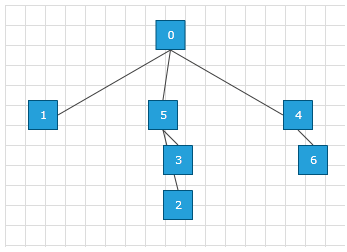

* __TreeLayoutType.RadialTree__:
            
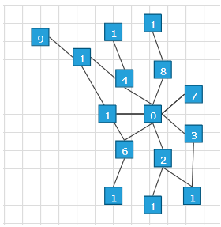

Here is how this could be achieved in code behind. 

{{source=..\SamplesCS\Diagram\DiagramItemsManipulation.cs region=TreeLayoutSettings}} 
{{source=..\SamplesVB\Diagram\DiagramItemsManipulation.vb region=TreeLayoutSettings}} 

````C#
            
Telerik.Windows.Diagrams.Core.TreeLayoutSettings settings = new Telerik.Windows.Diagrams.Core.TreeLayoutSettings()
{
    TreeLayoutType = Telerik.Windows.Diagrams.Core.TreeLayoutType.RadialTree,
    VerticalDistance = 20,
};
settings.Roots.Add(this.radDiagram1.Shapes[0]);
this.radDiagram1.SetLayout(Telerik.Windows.Diagrams.Core.LayoutType.Tree, settings);

````
````VB.NET
Dim settings As New Telerik.Windows.Diagrams.Core.TreeLayoutSettings() With { _
    .TreeLayoutType = Telerik.Windows.Diagrams.Core.TreeLayoutType.RadialTree, _
    .VerticalDistance = 20 _
}
Settings.Roots.Add(Me.RadDiagram1.Shapes(0))
Me.RadDiagram1.SetLayout(Telerik.Windows.Diagrams.Core.LayoutType.Tree, Settings)

````

{{endregion}} 
 
## Layout Settings

* __Component Layout and Settings__: One important aspect with respect to diagram layout is the concept of graph component. If a diagram consists of  separate sub-diagrams with no connection between them they are called components of a diagram.When applying a diagram layout to a diagram consisting of one or more components a layout is applied to each components and thereafter the components are organized in a grid.

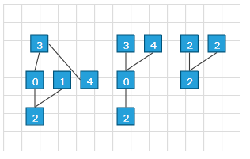 
The splitting in components is automatic and the grid layout of the components applied to both the tree layout and the layered layout types. The grid layout has the following settings which are both present as part of the <b>SugiyamaLayoutSettings</b> and the <b>TreeLayoutSettings</b>:

* __AnimateTransitions__: This property allows you to animate the dynamic changes of a Diagram layout. When you set the value of the property to *true* and dynamically change the layout settings of a Diagramming solution, an animation will be applied during the transition of the settings.
                

* __ComponentMargin__: the margin each component has in the grid layout.
                

* __ComponentsGridWidth__: the total width of the grid wherein the components are laid out.
                

* __IgnoreContainers__: gets or sets a boolean value indicating whether the shape containers are ignored when laying out the graph. If *false*, the shape containers will be considered as ordinary shapes in the tree layout process. You can additionally set the flag to perform a separate layout pass on the content of the containers. On the other hand, if this property is set to true the flag will have no effect since the layout process will be oblivious to the containers.
                

* __IgnoreInvisible__: gets or sets a boolean value indicating whether the non-visible diagram items have to be taken into account. If set to *true* shapes with __Visibility__ not set to *Visible* will be ignored.
                

* __LayoutContainerChildren__: gets or sets a boolean value indicating whether the content of the containers is processed on top of the global layout. This flag has only an effect if is set to *false*.
                

* __TotalMargin__: the margin around the (virtual) grid.
                

* __Sugiyama specific settings__

* __Orientation__: gets or sets the orientation in which the layout process should organize the diagram.
                

* __ShapeMargin__

* __VerticalDistance__: the vertical spacing between the layers.
                

* __HorizontalDistance__: the horizontal spacing between the layers.
                

* __Tree layout settings__

* __TreeLayoutType__: the subtype of the tree layout: TreeDown, TreeUp, TreeLeft, TreeRight TipOverTree, RadialTree, MindmapVertical, MindmapHorizontal. See the examples above for more details.
                

* __VerticalSeparation__: (applies only to the four standard tree types and the TipOverTree) the vertical separation between tree level.
                

* __HorizontalSeparation__: (applies only to the four standard tree types and the TipOverTree) the horizontal separation between siblings on the same level.
                

* __UnderneathVerticalTopOffset__: (applies only to the TipOverTree type) the offset from the parent of the first child.
                

* __UnderneathHorizontalOffset__: (applies only to the TipOverTree type) the horizontal offset between parent and child.
                

* __UnderneathVerticalSeparation__: (applies only to the TipOverTree type) the vertical offset between subsequent children.
                

* __Roots__: The Roots of the components. Use this collection of IShapes to set the roots of the trees in your diagram before layout.
                

* __TipOverTreeStartLevel__: this property applies only to the TipOverTree type and gets or sets the level from which a tip-over tree arrangement should be applied. A value of zero means that the children underneath the root will have a tip-over arrangement, a value of one means the grand-children of the root will have this applied and so on.
                

* __RadialSeparation__: (applies only to the RadialTree type) the radial distance between levels.
                

* __RadialFirstLevelSeparation__: (applies only to the RadialTree type) the radial distance between the root and the first level.
                

* __KeepComponentsInOneRadialLayout__: (applies only to the RadialTree type) if set to true the default behavior of organizing components into a grid will be overridden and the components will be considered as part of one radial tree. To this end a virtual root will be added which unifies the different components. See the example below.
                

* __StartRadialAngle__: The radial layout allows you to use a sector instead of the full 360 degrees. This start angle defines the beginning of this sector.
                

* __EndRadialAngle__: This end angle defines the end of the sector used (the part of 360 degrees used). Below you can see the explanation of the main TreeLayout Settings for the base 4 types (Up, Down, Left, Right) + TipOverTree.

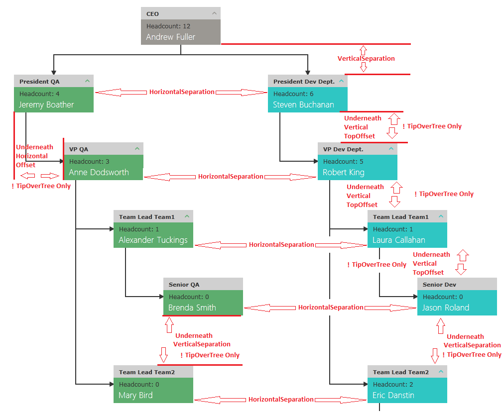Below you can see how the __KeepComponentsInOneRadialLayout__ actually works when you have more than one component:

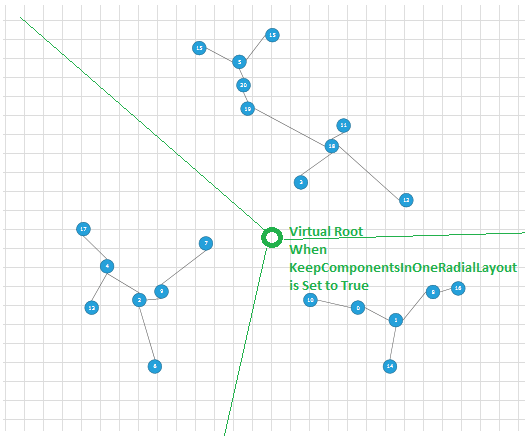

## Properties and Methods

The __RadDiagram__’s methods related with the Layout feature are the following ones:

* __SetLayout__:  of type void which organizes all the items in the __RadDiagram__ using specified layout type and settings. By default, the type is set to Sugiyama and the settings are set to null. You can define your custom layout type and settings and use them with the method.
            

* __LayoutAsync__:  just like the __SetLayout__ but acts asynchronously. This is why you should be careful when using this method. Keep in mind that it waits until all shapes, containers and connections are already generated and then gets executed within the following layout pass.
            

>note Choosing which method should be used depends on your custom scenario and requirements this is why no specific rule can be made. A good practice is to first evaluate how the __SetLayout__ method works and then to move to the __LayoutAsync__ if needed.
>


The properties that are related with the same feature are:

* __AutoLayout__: a boolean property that controls whether the __RadDiagram__ should automatically layout the items hosted in it whenever a new item is added or removed.
            

>note If you need to change the settings that are used when the automatic layout is triggered you should ones call the __LayoutAsync__ method with the new settings. In other words, the automatic layout uses the last settings that are used in the context of the __RadDiagram__ . By default, this feature is disabled.
>

