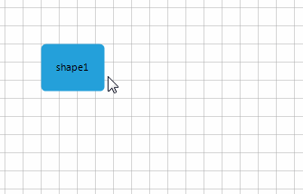
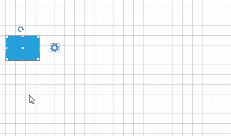

# Information Adorner

__RadDiagram__ shows information tool-tips that appear below the manipulation adorner when you resize, rotate or drag a shape or group of shapes and connections.
      
__RadDiagram__ uses the __ItemInformationAdorner__ to visualize information regarding the position, size and rotation angle of its shapes.  

<snippet id='diagram-information-adorner-enableinformationadorner-cs'/>
<snippet id='diagram-information-adorner-enableinformationadorner-vb'/>

 

Fig.1 visualizes the X and Y component of the current position of the shape when moving. It also visualizes the angle that the shape is rotated to and the current Width and Height of the corresponding shape when resizing.
>caption Figure 1: Information Adorner

## Custom ItemInformationAdorner 

__ItemInformationAdorner__ can be customized in order to display additional elements, e.g. a button. To achieve it, you should create a derivative of the __Telerik.WinControls.UI.Diagrams.Primitives.ItemInformationAdorner__ class and override its __CreateChildElements__ method. Here is demonstrated a sample code snippet: 

<snippet id='diagram-information-adorner-customiteminformationadorner-cs'/>
<snippet id='diagram-information-adorner-customiteminformationadorner-vb'/>

 

Now, you should apply the custom __ItemInformationAdorner__ to __DiagramElement__: 

<snippet id='diagram-information-adorner-assigncustomiteminformationadorner-cs'/>
<snippet id='diagram-information-adorner-assigncustomiteminformationadorner-vb'/>

 

>caption Figure 2: Custom Information Adorner

# See Also

* [RibbonUI]()	
* [Settings Pane]()	
* [Toolbox]()
