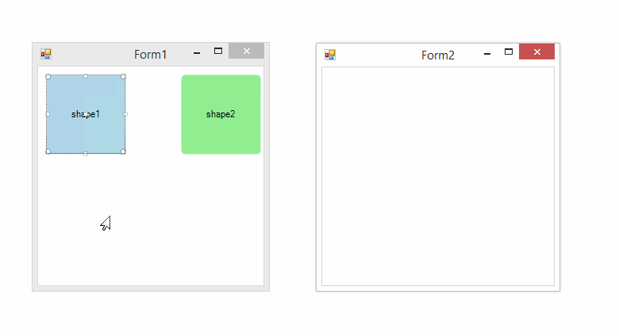

# Clipboard operations

__RadDiagram__ gives you the ability to Cut, Copy and Paste __RadDiagramItems__ within an application.

## Cut, Copy, Paste with keyboard

By default, the __AllowCopy__, __AllowCut__ and __AllowPaste__  properties are set to *true*  but you can set then to *false* in order to disable these Clipboard operations.

In order to cut, copy or paste particular __RadDiagramItems__  you have to select them and use the standard keyboard combinations:

* __(Ctrl + C)__ - copies the selected items.
            

* __(Ctrl + X)__ - cuts the selected items.
            

* __(Ctrl + V)__ - pastes the selected items.
            

You can perform these operations in a single form, but you can also copy/cut and paste items between several forms.

## Cut, Copy, Paste with DiagramCommands

You can use the __DiagramCommands__ "Cut", "Copy" and "Paste" in order to perform the standard clipboard operations. 

{{source=..\SamplesCS\Diagram\DiagramItemsManipulation.cs region=ClipboardCommands}} 
{{source=..\SamplesVB\Diagram\DiagramItemsManipulation.vb region=ClipboardCommands}} 

````C#
this.radDiagram1.SelectedItem = shape1;
this.radDiagram1.DiagramElement.TryExecuteCommand(DiagramCommands.Copy, "");
this.radDiagram2.DiagramElement.TryExecuteCommand(DiagramCommands.Paste, "");
this.radDiagram1.SelectedItem = shape2;
this.radDiagram1.DiagramElement.TryExecuteCommand(DiagramCommands.Cut, "");
this.radDiagram2.DiagramElement.TryExecuteCommand(DiagramCommands.Paste, "");

````
````VB.NET
Me.RadDiagram1.SelectedItem = shape1
Me.RadDiagram1.DiagramElement.TryExecuteCommand(DiagramCommands.Copy, "")
Me.RadDiagram2.DiagramElement.TryExecuteCommand(DiagramCommands.Paste, "")
Me.RadDiagram1.SelectedItem = shape2
Me.RadDiagram1.DiagramElement.TryExecuteCommand(DiagramCommands.Cut, "")
Me.RadDiagram2.DiagramElement.TryExecuteCommand(DiagramCommands.Paste, "")

````

{{endregion}} 


