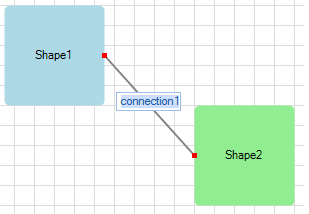
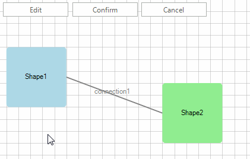

# Editing

__RadDiagram__ gives you the ability to edit the content of its items. You can double-click items in order to edit them or use [RadDiagramCommand]().

## Enable/Disable Editing

By default, the __RadDiagramItems__ are enabled for editing. In order to disable this functionality, you can use the __IsEditable__ property:

>caption Figure 1: IsEditable

 

<snippet id='diagram-editing-iseditable-cs'/>
<snippet id='diagram-editing-iseditable-vb'/>

 
 

## Start Editing By Using Keyboard

Once the edit behavior is enabled, you can start the editing process by selecting the item and pressing the F2 key.
        

## Controlling Editing in Code Behind

In order to start/end editing a __RadDiagramItem__, you can set __IsInEditMode__ property to *true*/*false*.
        

__RadDiagramItem__ also provides four editing events:

* __PreviewBeginEdit__: fires when a __RadDiagramItem__ is about to be edited. It is cancelable.
            

* __BeginEdit__: fires when a __RadDiagramItem__ has just entered in edit mode.
In the code snippet below it is demonstrated how to access the editor element:

#### Access editor element 

<snippet id='diagram-editing-geteditor-cs'/>
<snippet id='diagram-editing-geteditor-vb'/>

 
            

* __PreviewEndEdit__: fires when a __RadDiagramItem__ is about to leave the edit mode. It is cancelable.
            

* __EndEdit__: fires when a __RadDiagramItem__ has just left the edit mode.
            

## Edit using Commands

__RadDiagram__ provides three predefined commands for editing the selected item - __BeginEdit__, __CommitEdit__ and __CancelEdit__.

>caption Figure 2: Editing by commands

 

<snippet id='diagram-editing-editcommands-cs'/>
<snippet id='diagram-editing-editcommands-vb'/>

 

