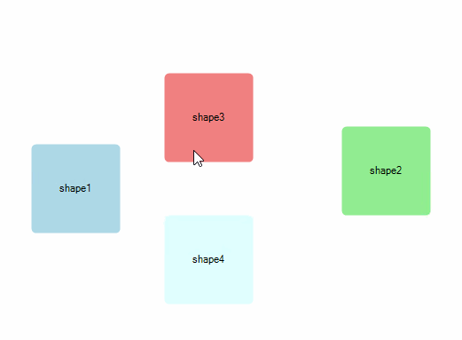

# Removing items

__RadDiagram__ gives you the ability to remove __RadDiagramItems__ interactively, programmatically or with __DiagramCommands__.

## Removing Items Interactively

You can remove the selected __RadDiagramItems__ by pressing the Delete Key.

Below you can see the result of delete operation over the selected __RadDiagramItems__:

## Removing Items in code behind

You can remove __RadDiagramItems__ in code behind by using the RadDiagram.__Items__ collection and its __Remove()__ or __RemoveAt()__ methods: 

<snippet id='diagram-removing-items-removeitems-cs'/>
<snippet id='diagram-removing-items-removeitems-vb'/>

 

 
## Delete with DiagramCommands

You can use the __DiagramCommand__ "Delete" in order to remove the selected __RadDiagramItems__. 

<snippet id='diagram-removing-items-deletecommands-cs'/>
<snippet id='diagram-removing-items-deletecommands-vb'/>

 

