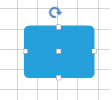
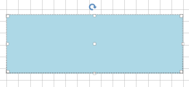

# Resizing

__RadDiagram__ gives you the ability to resize shapes by dragging their __Resizing Thumbs__. You can also use the shapes' __Width__ and __Height__ for this purpose.

## Enable/Disable resizing

By default, the __RadDiagram__ is enabled for resizing manipulation. In order to disable this functionality, you can set the __IsResizingEnabled__ property to *false*.

 

{{source=..\SamplesCS\Diagram\DiagramItemsManipulation.cs region=EnableResizing}} 
{{source=..\SamplesVB\Diagram\DiagramItemsManipulation.vb region=EnableResizing}} 

````C#
this.radDiagram1.IsResizingEnabled = false;

````
````VB.NET
Me.RadDiagram1.IsResizingEnabled = False

````

{{endregion}} 
 

## Manipulation adorner

The __IsManipulationAdornerVisible__ property controls whether the manipulation adorner will be displayed or not.

## Width and Height

You can resize shapes by using their __Width__ and __Height__ properties:

 


{{source=..\SamplesCS\Diagram\DiagramItemsManipulation.cs region=ResizeShape}} 
{{source=..\SamplesVB\Diagram\DiagramItemsManipulation.vb region=ResizeShape}} 

````C#
RadDiagramShape resizedShape = new RadDiagramShape()
{
    Text = "",
    ElementShape = new RoundRectShape(5),
    BackColor = System.Drawing.Color.LightBlue
};
resizedShape.Width = 300;
resizedShape.Height = 100;
resizedShape.Position = new Telerik.Windows.Diagrams.Core.Point(10, 10);
radDiagram1.Items.Add(resizedShape);

````
````VB.NET
Dim resizedShape As New RadDiagramShape() With { _
    .Text = "", _
    .ElementShape = New RoundRectShape(5), _
    .BackColor = System.Drawing.Color.LightBlue _
}
resizedShape.Width = 300
resizedShape.Height = 100
resizedShape.Position = New Telerik.Windows.Diagrams.Core.Point(10, 10)
RadDiagram1.Items.Add(resizedShape)

````

{{endregion}} 


