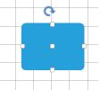
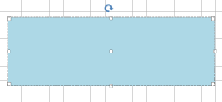

# Resizing

__RadDiagram__ gives you the ability to resize shapes by dragging their __Resizing Thumbs__. You can also use the shapes' __Width__ and __Height__ for this purpose.

## Enable/Disable resizing

By default, the __RadDiagram__ is enabled for resizing manipulation. In order to disable this functionality, you can set the __IsResizingEnabled__ property to *false*.

 

<snippet id='diagram-resizing-enableresizing-cs'/>
<snippet id='diagram-resizing-enableresizing-vb'/>

 
 

## Manipulation adorner

The __IsManipulationAdornerVisible__ property controls whether the manipulation adorner will be displayed or not.

## Width and Height

You can resize shapes by using their __Width__ and __Height__ properties:

 

<snippet id='diagram-resizing-resizeshape-cs'/>
<snippet id='diagram-resizing-resizeshape-vb'/>

 

