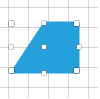
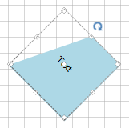

# Rotation

__RadDiagram__ gives you the ability to rotate shapes by dragging their Rotation Thumb or by changing their __RotationAngle__ property.

## Enable/Disable rotation

By default, the __RadDiagram__ is enabled for rotation manipulation. In order to disable this functionality, you can set the __IsRotationEnabled__ property to *false*.

 

<snippet id='diagram-rotation-enablerotation-cs'/>
<snippet id='diagram-rotation-enablerotation-vb'/>

 

 
## Rotation Angle

You can rotate shapes by using their __RotationAngle__ property: 

 

<snippet id='diagram-rotation-rotationangle-cs'/>
<snippet id='diagram-rotation-rotationangle-vb'/>

 

