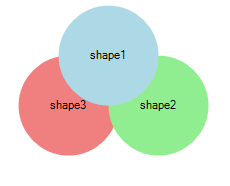
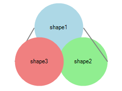
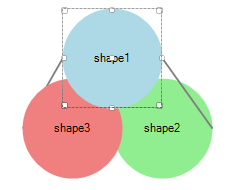
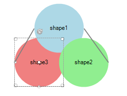

# ZOrder

__RadDiagram__ gives you the ability to control the Z-Order of shapes and connections by using their __ZIndex__ property. You can also use __RadDiagramCommands__ in order to increase/decrease __ZIndex__ of the selected __RadDiagramItems__ simultaneously.

## Using the ZIndex property

Consider the following code: 

<snippet id='diagram-zorder-zorder-cs'/>
<snippet id='diagram-zorder-zorder-vb'/>

 
 

We have reversed the natural ZOrder of the 3 Shapes. 

## Using the RadDiagram Commands

__RadDiagram__ provides a set of predefined commands for manipulating the selected items' ZIndices. "BringForward" and "SendBackward" allow you to increase/decrease the Z-Indices of the selected __RadDiagramItems__. If you need to bring the selected item(s) on top of all other items or below them, you can use "BringToFront" and "SentToback": 

<snippet id='diagram-zorder-commandzindex-cs'/>
<snippet id='diagram-zorder-commandzindex-vb'/>

 

This way configured, the items in __RadDiagram__ are ordered as illustrated below: 

Here is the result of selecting the first shape and executing the DiagramCommands.__BringToFront__:

 

<snippet id='diagram-zorder-bringtofront-cs'/>
<snippet id='diagram-zorder-bringtofront-vb'/>

 
 

Here is the result of selecting the third shape and executing the DiagramCommands.__SendToBack__:

 

<snippet id='diagram-zorder-sendtoback-cs'/>
<snippet id='diagram-zorder-sendtoback-vb'/>

 

