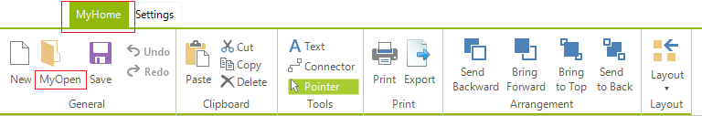
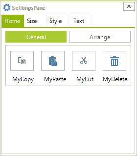

# Localization


This tutorial describes the localization support implemented in __RadDiagram__.

## Localizing RadDiagramRibbonBar 

To localize __RadDiagramRibbonBar__ to display control text and messages in a specific language:
        

1\. Start by creating a descendant of the __DiagramRibbonBarLocalizationProvider__ class.
            

2\. Override the __GetLocalizedString(string id)__ method and provide a translation for the texts. If a translation is not provided, the default value will be returned. This behavior is guaranteed by the call to the base __GetLocalizedString__ method in the default clause of the switch statement in the example. Below is a sample implementation of a custom localization provider: 

{{source=..\SamplesCS\Diagram\DiagramLocalization.cs region=RibbonUILocalization}} 
{{source=..\SamplesVB\Diagram\DiagramLocalization.vb region=RibbonUILocalization}} 

````C#
        
public class MyDiagramRibbonBarLocalizationProvider : DiagramRibbonBarLocalizationProvider
{
    public override string GetLocalizedString(string id)
    {
        switch (id)
        {
            case DiagramRibbonBarStringId.DiagramRibbonBarHomeTab:
                return "MyHome";
            case DiagramRibbonBarStringId.DiagramRibbonBarButtonOpen:
                return "MyOpen";
            default:
                return base.GetLocalizedString(id);
        }
    }
}

````
````VB.NET
Public Class MyDiagramRibbonBarLocalizationProvider
    Inherits DiagramRibbonBarLocalizationProvider
    Public Overrides Function GetLocalizedString(id As String) As String
        Select Case id
            Case DiagramRibbonBarStringId.DiagramRibbonBarHomeTab
                Return "MyHome"
            Case DiagramRibbonBarStringId.DiagramRibbonBarButtonOpen
                Return "MyOpen"
            Case Else
                Return MyBase.GetLocalizedString(id)
        End Select
    End Function
End Class

````

{{endregion}} 

3\. To apply the custom localization provider, instantiate and assign it to the current localization provider: 

{{source=..\SamplesCS\Diagram\DiagramLocalization.cs region=SetRibbonUILocalization}} 
{{source=..\SamplesVB\Diagram\DiagramLocalization.vb region=SetRibbonUILocalization}} 

````C#
            
DiagramRibbonBarLocalizationProvider.CurrentProvider = new MyDiagramRibbonBarLocalizationProvider();

````
````VB.NET
DiagramRibbonBarLocalizationProvider.CurrentProvider = New MyDiagramRibbonBarLocalizationProvider()

````

{{endregion}} 




## Localizing SettingsPane

To localize __RadDiagramSettingsPane__ to display control text and messages in a specific language:
        

1\. Start by creating a descendant of the __DiagramSettingsPaneLocalizationProvider__ class.
            

2\. Override the __GetLocalizedString(string id)__ method and provide a translation for the texts. If a translation is not provided, the default value will be returned. This behavior is guaranteed by the call to the base __GetLocalizedString__ method in the default clause of the switch statement in the example. 

{{source=..\SamplesCS\Diagram\DiagramLocalization.cs region=SettingsPaneLocalization}} 
{{source=..\SamplesVB\Diagram\DiagramLocalization.vb region=SettingsPaneLocalization}} 
	
````C#
        
public class MyDiagramSettingsPaneLocalizationProvider : DiagramSettingsPaneLocalizationProvider
{
    public override string GetLocalizedString(string id)
    {
        switch (id)
        {
            case DiagramSettingsPaneStringId.LabelCopy:
                return "MyCopy";
            case DiagramSettingsPaneStringId.LabelPaste:
                return "MyPaste";
            case DiagramSettingsPaneStringId.LabelCut:
                return "MyCut";
            case DiagramSettingsPaneStringId.LabelDelete:
                return "MyDelete";
            default:
                return base.GetLocalizedString(id);
        }
    }
}

````
````VB.NET
Public Class MyDiagramSettingsPaneLocalizationProvider
    Inherits DiagramSettingsPaneLocalizationProvider
    Public Overrides Function GetLocalizedString(id As String) As String
        Select Case id
            Case DiagramSettingsPaneStringId.LabelCopy
                Return "MyCopy"
            Case DiagramSettingsPaneStringId.LabelPaste
                Return "MyPaste"
            Case DiagramSettingsPaneStringId.LabelCut
                Return "MyCut"
            Case DiagramSettingsPaneStringId.LabelDelete
                Return "MyDelete"
            Case Else
                Return MyBase.GetLocalizedString(id)
        End Select
    End Function
End Class

````

{{endregion}} 

3\. To apply the custom localization provider, instantiate and assign it to the current localization provider: 

{{source=..\SamplesCS\Diagram\DiagramLocalization.cs region=SetSettingsPaneLocalization}} 
{{source=..\SamplesVB\Diagram\DiagramLocalization.vb region=SetSettingsPaneLocalization}} 

````C#
            
DiagramSettingsPaneLocalizationProvider.CurrentProvider = new MyDiagramSettingsPaneLocalizationProvider();

````
````VB.NET
DiagramSettingsPaneLocalizationProvider.CurrentProvider = New MyDiagramSettingsPaneLocalizationProvider()

````

{{endregion}} 



