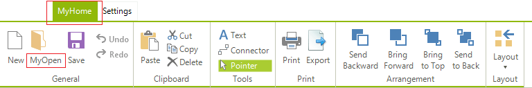
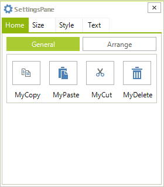

# Localization

This tutorial describes the localization support implemented in __RadDiagram__.

## Localizing RadDiagramRibbonBar 

To localize __RadDiagramRibbonBar__ to display control text and messages in a specific language:
        

1\. Start by creating a descendant of the __DiagramRibbonBarLocalizationProvider__ class.
            

2\. Override the __GetLocalizedString(string id)__ method and provide a translation for the texts. If a translation is not provided, the default value will be returned. This behavior is guaranteed by the call to the base __GetLocalizedString__ method in the default clause of the switch statement in the example. Below is a sample implementation of a custom localization provider: 

<snippet id='diagram-localization-ribbonuilocalization-cs' />
<snippet id='diagram-localization-ribbonuilocalization-vb' />

3\. To apply the custom localization provider, instantiate and assign it to the current localization provider: 

<snippet id='diagram-localization-setribbonuilocalization-cs' />
<snippet id='diagram-localization-setribbonuilocalization-vb' />

## Localizing SettingsPane

To localize __RadDiagramSettingsPane__ to display control text and messages in a specific language:
        

1\. Start by creating a descendant of the __DiagramSettingsPaneLocalizationProvider__ class.
            

2\. Override the __GetLocalizedString(string id)__ method and provide a translation for the texts. If a translation is not provided, the default value will be returned. This behavior is guaranteed by the call to the base __GetLocalizedString__ method in the default clause of the switch statement in the example. 

<snippet id='diagram-localization-settingspanelocalization-cs' />
<snippet id='diagram-localization-settingspanelocalization-vb' />

3\. To apply the custom localization provider, instantiate and assign it to the current localization provider: 

<snippet id='diagram-localization-setsettingspanelocalization-cs' />
<snippet id='diagram-localization-setsettingspanelocalization-vb' />

