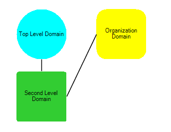

# Populating with data

This article will demonstrate how to define shapes and connections programmatically and how to load predefined layout by XML.

## Adding items in code behind

Below you can find a code snippet which creates three shapes and connections between them: 

{{source=..\SamplesCS\Diagram\DiagramPopulatingWithData.cs region=PopulateData}} 
{{source=..\SamplesVB\Diagram\DiagramPopulatingWithData.vb region=PopulateData}} 

````C#
    
RadDiagramShape shape1 = new RadDiagramShape()
{
    Text = "Second Level Domain",
    ElementShape = new RoundRectShape(4),
    BackColor = Color.LimeGreen
};
shape1.Position = new Telerik.Windows.Diagrams.Core.Point(100, 100);
radDiagram1.Items.Add(shape1);
    
RadDiagramShape shape2 = new RadDiagramShape()
{
    Text = "Top Level Domain",
    ElementShape = new RoundRectShape(50),
    BackColor = Color.Cyan
};
shape2.Position = new Telerik.Windows.Diagrams.Core.Point(400, 100);
radDiagram1.Items.Add(shape2);
    
RadDiagramShape shape3 = new RadDiagramShape()
{
    Text = "Organization Domain",
    ElementShape = new RoundRectShape(20),
    BackColor = Color.Yellow
};
shape3.Position = new Telerik.Windows.Diagrams.Core.Point(400, 400);
radDiagram1.Items.Add(shape3);
            
RadDiagramConnection connection1 = new RadDiagramConnection()
{ Name = "connection1" };
connection1.Source = shape1;
connection1.Target = shape2;
radDiagram1.Items.Add(connection1);
    
RadDiagramConnection connection2 = new RadDiagramConnection()
{
    Name = "connection2"
};
connection2.Source = shape1;
connection2.Target = shape3;
radDiagram1.Items.Add(connection2);

````
````VB.NET
Dim shape1 As New RadDiagramShape() With { _
    .Text = "Second Level Domain", _
    .ElementShape = New RoundRectShape(4), _
    .BackColor = Color.LimeGreen _
}
shape1.Position = New Telerik.Windows.Diagrams.Core.Point(100, 100)
RadDiagram1.Items.Add(shape1)
Dim shape2 As New RadDiagramShape() With { _
    .Text = "Top Level Domain", _
    .ElementShape = New RoundRectShape(50), _
    .BackColor = Color.Cyan _
}
shape2.Position = New Telerik.Windows.Diagrams.Core.Point(400, 100)
RadDiagram1.Items.Add(shape2)
Dim shape3 As New RadDiagramShape() With { _
    .Text = "Organization Domain", _
    .ElementShape = New RoundRectShape(20), _
    .BackColor = Color.Yellow _
}
shape3.Position = New Telerik.Windows.Diagrams.Core.Point(400, 400)
RadDiagram1.Items.Add(shape3)
Dim connection1 As New RadDiagramConnection() With { _
    .Name = "connection1" _
}
connection1.Source = shape1
connection1.Target = shape2
RadDiagram1.Items.Add(connection1)
Dim connection2 As New RadDiagramConnection() With { _
    .Name = "connection2" _
}
connection2.Source = shape1
connection2.Target = shape3
RadDiagram1.Items.Add(connection2)

````

{{endregion}} 




## Load items from XML

You can load items in __RadDiagram__ from XML. Here is a sample code snippet:
  
{{source=..\SamplesCS\Diagram\DiagramPopulatingWithData.cs region=LoadFromXML}} 
{{source=..\SamplesVB\Diagram\DiagramPopulatingWithData.vb region=LoadFromXML}} 

````C#
            
OpenFileDialog openFileDialog1 = new OpenFileDialog();
            
openFileDialog1.InitialDirectory = "c:\\";
openFileDialog1.Filter = "xml files (*.xml)|*.xml|All files (*.*)|*.*";            
openFileDialog1.RestoreDirectory = true;
            
if (openFileDialog1.ShowDialog() == DialogResult.OK)
{
    string filename = openFileDialog1.FileName;
        
    string filelines = File.ReadAllText(filename);
    try
    {
        radDiagram1.DiagramElement.Items.Clear();
        radDiagram1.DiagramElement.Load(filelines);
    }
    catch (Exception ex)
    {
        MessageBox.Show("Unable to load " + filename + "\nError: " + ex.Message);
    }
}

````
````VB.NET
Dim openFileDialog1 As New OpenFileDialog()
openFileDialog1.InitialDirectory = "c:\"
openFileDialog1.Filter = "xml files (*.xml)|*.xml|All files (*.*)|*.*"
openFileDialog1.RestoreDirectory = True
If openFileDialog1.ShowDialog() = DialogResult.OK Then
    Dim filename As String = openFileDialog1.FileName
    Dim filelines As String = File.ReadAllText(filename)
    Try
        RadDiagram1.DiagramElement.Items.Clear()
        RadDiagram1.DiagramElement.Load(filelines)
    Catch ex As Exception
        MessageBox.Show((Convert.ToString("Unable to load ") & filename) + vbLf & "Error: " + ex.Message)
    End Try
End If

````

{{endregion}} 


>note  __RadDiagramRibbonBar__ introduces UI for save to XML and load from XML functionality. In the code behind you can use the DiagramElement. __Load__ and DiagramElement. __Save__ methods.
>


Here is a sample xml file for storing two shapes and a connection between them:
        
````XML
<?xml version="1.0" encoding="utf-8"?>
<RadDiagram Version="2015.1">
  <Metadata Type="Telerik.WinControls.UI.RadDiagramElement" Id="42311b7f-35b5-49a5-b92b-6d149d8bcf4d" Position="0;0">
    <Title>Diagram [4/6/2015 4:30:25 PM]</Title>
    <Description></Description>
  </Metadata>
  <Groups />
  <Shapes QNs="Telerik.WinControls.RadDiagram, Version=2015.1.331.40, Culture=neutral, PublicKeyToken=5bb2a467cbec794e;">
    <RadDiagramShape Type="Telerik.WinControls.UI.RadDiagramShape" Id="b44facd3-cddb-43d7-a253-b66ba024567b" ZIndex="0" Position="150;136" Size="70;54" RotationAngle="0" MinWidth="0" MinHeight="0" MaxWidth="INF" MaxHeight="INF" UseDefaultConnectors="True" ElementShape="Telerik.WinControls.RoundRectShape|5" InternalElementColor="#25A0DA" ShapeText="" QN="0">
      <Connectors QNs="Telerik.WinControls.RadDiagram, Version=2015.1.331.40, Culture=neutral, PublicKeyToken=5bb2a467cbec794e;">
        <RadDiagramConnector Type="Telerik.WinControls.UI.Diagrams.RadDiagramConnector" Name="Auto" Offset="0.5;0.5" Width="4" Height="4" QN="0" />
        <RadDiagramConnector Type="Telerik.WinControls.UI.Diagrams.RadDiagramConnector" Name="Left" Offset="0;0.5" Width="4" Height="4" QN="0" />
        <RadDiagramConnector Type="Telerik.WinControls.UI.Diagrams.RadDiagramConnector" Name="Top" Offset="0.5;0" Width="4" Height="4" QN="0" />
        <RadDiagramConnector Type="Telerik.WinControls.UI.Diagrams.RadDiagramConnector" Name="Right" Offset="1;0.5" Width="4" Height="4" QN="0" />
        <RadDiagramConnector Type="Telerik.WinControls.UI.Diagrams.RadDiagramConnector" Name="Bottom" Offset="0.5;1" Width="4" Height="4" QN="0" />
      </Connectors>
    </RadDiagramShape>
    <RadDiagramShape Type="Telerik.WinControls.UI.RadDiagramShape" Id="f4a29125-a536-42e1-aeb0-463f4cfb4571" ZIndex="0" Position="337;137" Size="70;54" RotationAngle="0" MinWidth="0" MinHeight="0" MaxWidth="INF" MaxHeight="INF" UseDefaultConnectors="True" ElementShape="Telerik.WinControls.EllipseShape" InternalElementColor="#25A0DA" ShapeText="" QN="0">
      <Connectors QNs="Telerik.WinControls.RadDiagram, Version=2015.1.331.40, Culture=neutral, PublicKeyToken=5bb2a467cbec794e;">
        <RadDiagramConnector Type="Telerik.WinControls.UI.Diagrams.RadDiagramConnector" Name="Auto" Offset="0.5;0.5" Width="4" Height="4" QN="0" />
        <RadDiagramConnector Type="Telerik.WinControls.UI.Diagrams.RadDiagramConnector" Name="Left" Offset="0;0.5" Width="4" Height="4" QN="0" />
        <RadDiagramConnector Type="Telerik.WinControls.UI.Diagrams.RadDiagramConnector" Name="Top" Offset="0.5;0" Width="4" Height="4" QN="0" />
        <RadDiagramConnector Type="Telerik.WinControls.UI.Diagrams.RadDiagramConnector" Name="Right" Offset="1;0.5" Width="4" Height="4" QN="0" />
        <RadDiagramConnector Type="Telerik.WinControls.UI.Diagrams.RadDiagramConnector" Name="Bottom" Offset="0.5;1" Width="4" Height="4" QN="0" />
      </Connectors>
    </RadDiagramShape>
  </Shapes>
  <Connections QNs="Telerik.WinControls.RadDiagram, Version=2015.1.331.40, Culture=neutral, PublicKeyToken=5bb2a467cbec794e;">
    <RadDiagramConnection Type="Telerik.WinControls.UI.RadDiagramConnection" Id="eeea2872-f633-4038-8b39-77b3dcd0f8c1" ZIndex="0" Position="220;162" SourceConnectorPosition="Auto" TargetConnectorPosition="Auto" SourceCapType="None" TargetCapType="None" SourceCapSize="7;7" TargetCapSize="7;7" StartPoint="220;163" Source="b44facd3-cddb-43d7-a253-b66ba024567b" EndPoint="370;162" ConnectionType="Polyline" ConnectionPoints="" IsModified="False" QN="0" />
  </Connections>
</RadDiagram>

````

# See Also

* [DataBinding]()


