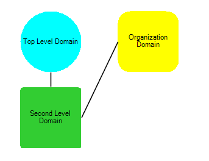

# Populating with data

This article will demonstrate how to define shapes and connections programmatically and how to load predefined layout by XML.

## Adding items in code behind

Below you can find a code snippet which creates three shapes and connections between them: 

<snippet id='diagram-populating-with-data-populatedata-cs' />
<snippet id='diagram-populating-with-data-populatedata-vb' />




## Load items from XML

You can load items in __RadDiagram__ from XML. Here is a sample code snippet:
  
<snippet id='diagram-populating-with-data-loadfromxml-cs' />
<snippet id='diagram-populating-with-data-loadfromxml-vb' />


>note  __RadDiagramRibbonBar__ introduces UI for save to XML and load from XML functionality. In the code behind you can use the DiagramElement. __Load__ and DiagramElement. __Save__ methods.
>


Here is a sample xml file for storing two shapes and a connection between them:
        
````XML
<?xml version="1.0" encoding="utf-8"?>
<RadDiagram Version="2015.1">
  <Metadata Type="Telerik.WinControls.UI.RadDiagramElement" Id="42311b7f-35b5-49a5-b92b-6d149d8bcf4d" Position="0;0">
    <Title>Diagram [4/6/2015 4:30:25 PM]</Title>
    <Description></Description>
  </Metadata>
  <Groups />
  <Shapes QNs="Telerik.WinControls.RadDiagram, Version=2015.1.331.40, Culture=neutral, PublicKeyToken=5bb2a467cbec794e;">
    <RadDiagramShape Type="Telerik.WinControls.UI.RadDiagramShape" Id="b44facd3-cddb-43d7-a253-b66ba024567b" ZIndex="0" Position="150;136" Size="70;54" RotationAngle="0" MinWidth="0" MinHeight="0" MaxWidth="INF" MaxHeight="INF" UseDefaultConnectors="True" ElementShape="Telerik.WinControls.RoundRectShape|5" InternalElementColor="#25A0DA" ShapeText="" QN="0">
      <Connectors QNs="Telerik.WinControls.RadDiagram, Version=2015.1.331.40, Culture=neutral, PublicKeyToken=5bb2a467cbec794e;">
        <RadDiagramConnector Type="Telerik.WinControls.UI.Diagrams.RadDiagramConnector" Name="Auto" Offset="0.5;0.5" Width="4" Height="4" QN="0" />
        <RadDiagramConnector Type="Telerik.WinControls.UI.Diagrams.RadDiagramConnector" Name="Left" Offset="0;0.5" Width="4" Height="4" QN="0" />
        <RadDiagramConnector Type="Telerik.WinControls.UI.Diagrams.RadDiagramConnector" Name="Top" Offset="0.5;0" Width="4" Height="4" QN="0" />
        <RadDiagramConnector Type="Telerik.WinControls.UI.Diagrams.RadDiagramConnector" Name="Right" Offset="1;0.5" Width="4" Height="4" QN="0" />
        <RadDiagramConnector Type="Telerik.WinControls.UI.Diagrams.RadDiagramConnector" Name="Bottom" Offset="0.5;1" Width="4" Height="4" QN="0" />
      </Connectors>
    </RadDiagramShape>
    <RadDiagramShape Type="Telerik.WinControls.UI.RadDiagramShape" Id="f4a29125-a536-42e1-aeb0-463f4cfb4571" ZIndex="0" Position="337;137" Size="70;54" RotationAngle="0" MinWidth="0" MinHeight="0" MaxWidth="INF" MaxHeight="INF" UseDefaultConnectors="True" ElementShape="Telerik.WinControls.EllipseShape" InternalElementColor="#25A0DA" ShapeText="" QN="0">
      <Connectors QNs="Telerik.WinControls.RadDiagram, Version=2015.1.331.40, Culture=neutral, PublicKeyToken=5bb2a467cbec794e;">
        <RadDiagramConnector Type="Telerik.WinControls.UI.Diagrams.RadDiagramConnector" Name="Auto" Offset="0.5;0.5" Width="4" Height="4" QN="0" />
        <RadDiagramConnector Type="Telerik.WinControls.UI.Diagrams.RadDiagramConnector" Name="Left" Offset="0;0.5" Width="4" Height="4" QN="0" />
        <RadDiagramConnector Type="Telerik.WinControls.UI.Diagrams.RadDiagramConnector" Name="Top" Offset="0.5;0" Width="4" Height="4" QN="0" />
        <RadDiagramConnector Type="Telerik.WinControls.UI.Diagrams.RadDiagramConnector" Name="Right" Offset="1;0.5" Width="4" Height="4" QN="0" />
        <RadDiagramConnector Type="Telerik.WinControls.UI.Diagrams.RadDiagramConnector" Name="Bottom" Offset="0.5;1" Width="4" Height="4" QN="0" />
      </Connectors>
    </RadDiagramShape>
  </Shapes>
  <Connections QNs="Telerik.WinControls.RadDiagram, Version=2015.1.331.40, Culture=neutral, PublicKeyToken=5bb2a467cbec794e;">
    <RadDiagramConnection Type="Telerik.WinControls.UI.RadDiagramConnection" Id="eeea2872-f633-4038-8b39-77b3dcd0f8c1" ZIndex="0" Position="220;162" SourceConnectorPosition="Auto" TargetConnectorPosition="Auto" SourceCapType="None" TargetCapType="None" SourceCapSize="7;7" TargetCapSize="7;7" StartPoint="220;163" Source="b44facd3-cddb-43d7-a253-b66ba024567b" EndPoint="370;162" ConnectionType="Polyline" ConnectionPoints="" IsModified="False" QN="0" />
  </Connections>
</RadDiagram>

````

# See Also

* [DataBinding]()


