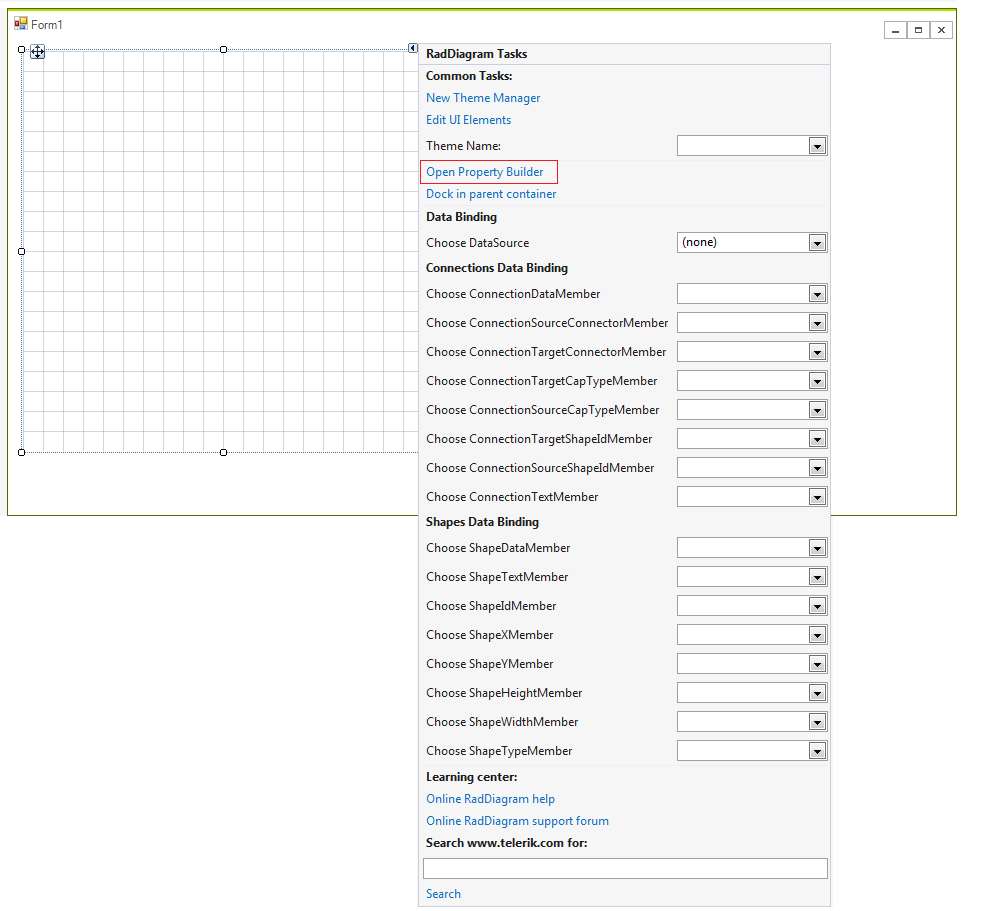

# Property Builder

In order to populate __RadDiagram__ with __RadDiagramItems__ you can add __RadDiagramShapes__ and __RadDiagramConnections__ by using the Property Builder.

>caption Figure 1: Smart Tag >> Open Property Builder

>caption Figure 2: Property Builder

The Property Builder allows you to drag a shapes from the [RadDiagramToolbox]() and drop it onto the __RadDiagram__ surface. Afterwards, you can connect several shapes by using the connectors. The [RadDiagramRibbonBar]() gives you a set of options to customize the diagram and save the changes as well.
      
 