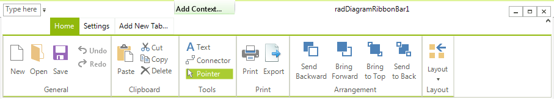
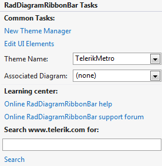

# RibbonUI

__RadDiagramRibbonBar__ is a ribbon control that has been wired to work with the API that  __RadDiagram__ exposes.
      

>important As of R3 2022 RadDiagramRibbonBar allows you to disable the default logic for the `New`, `Open` and `Save` buttons. Then, it is possible to subscribe to the Click event of the respective button and introduce any custom logic. The following public properties are available (by default, they are set to **false**):
>
>* **DisableDefaultNewAction** - disables the `New` button's default logic. 
>* **DisableDefaultOpenAction** - disables the `Open` button's default logic. 
>* **DisableDefaultSaveAction** - disables the `Save` button's default logic. 

## Using RadDiagramRibbonBar

__RadDiagramRibbonBar__ can be found in the Toolbox of Visual Studio, if you have installed the controls automatically. In order to use it, drag an instance of the __RadDiagramRibbonBar__ in the designer area and drop it. Then, you can set the associated __RadDiagram__ by either using the smart tag or setting the __AssociatedDiagram__ property.

__RadDiagramRibbonBar__ introduces UI for saving and loading predefined diagramming layouts. Additionally, you can manipulate the ZOrder of the shapes and perform clipboard operations.
        
# See Also
 
* [Settings Pane]()	
* [Toolbox]()
* [How to Add Custom Items to RadDiagramRibbonBar]()