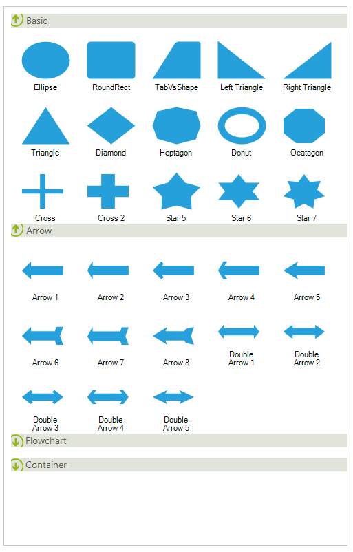

# Toolbox

__RadDiagramToolbox__  introduces a set of shapes that can be dragged to a __RadDiagram__. Internally, this control is a derivative of **RadListView** in ListViewType.**IconsView** which is grouped by shape types.

## Using the RadDiagramToolbox at design time

Since __RadDiagramToolbox__ is a separate control it is available in the toolbox. Here is how to put it in action:

1. Drag and drop __RadDiagramToolbox__ on the form.
            

1. Drag and drop __RadDiagram__ on the form.
            

1. Run the application. Now, you are allowed to drag any shape from the __RadDiagramToolbox__ and drop it onto the __RadDiagram__.  
            

# See Also

* [RibbonUI]()	
* [Settings Pane]()	 
* [Add Custom Items to Diagram Toolbox]()
