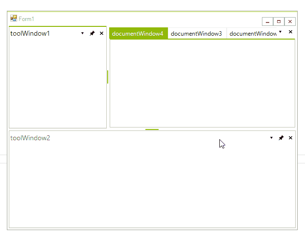

# Docking Assistant
 
The __Docking Assistant__ indicates the relationship of a dragged panel to the rest of the docking layout. Use the __Docking Assistant__ at runtime to pinpoint drag-drop destinations.

## Component Parts of the Docking Assistant

This tool is made up of an outer zone and an inner zone of controls. The outer zone consists of four satellite grips, situated at the four points of a virtual compass over the docking container. It is used for positioning a **DockWindow** relative to the primary host container. The inner zone has a center compass with icons for positioning a **DockWindow** in the underlying docking container or in another docking container relative to the underlying one. All of these icons represent a drop target, i.e. the destination for the **DockWindow** you are moving.

## Using the Docking Assistant

To use the __Docking Assistant__, use the mouse to select the title bar of the source **DockWindow**. Drag the window over the host (destination) container. This action activates the Docking Assistant. Point to the inner or outer zone icon that represents the area you want the **DockWindow** to occupy. When the mouse button is released, the **DockWindow** is relocated. Other windows in the host container, as well as other docking containers within the __RadDock__, are relocated to accommodate the change.

## Docking Hints

In addition to the drop target icons, the docking assistant displays docking hints. A docking hint is a visual preview of what space will be occupied by a **DockWindow**. Drop hints are enabled when you are in the process of moving the **DockWindow** and while the mouse pointer is positioned over one of the drop targets.
 
 

## Tabbing/Un-tabbing DockWindows

In addition to moving **ToolWindows** from one docking container to another, you can place multiple **ToolWindow** into the same visual space so that they overlap. Each window within the overlapped docking area is accessible by use of document tabs.

To place a __ToolWindow__ as a tab, use the drop target icon at the center of the __RadDock__ compass when you drag a __ToolWindow__ to its destination. The two __ToolWindows__ will overlap each other at the site of the destination. Other docking containers and __ToolWindow__ will resize themselves automatically to fill the available space, subject to any minimum or maximum size specifications set at design time.

To un-tab a **ToolWindow**, drag the **ToolWindow** tab into a docking container using the docking assistant.

# See Also

* [Getting Started]()
* [Using the CommandManager]()     
* [Using the ContextMenuService]()
* [Using the DragDropService]() 
* [Document Manager]()   
* [Understanding RadDock]()

