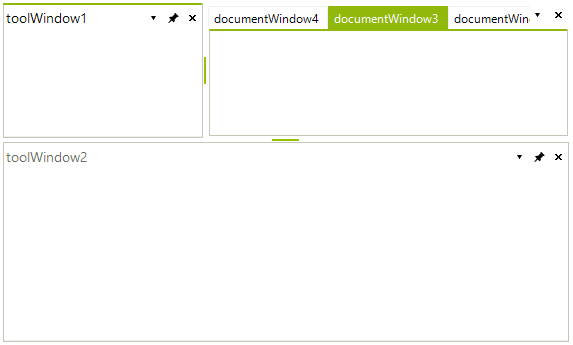
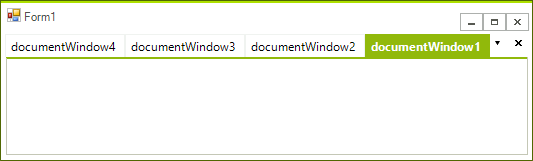
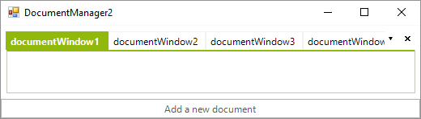
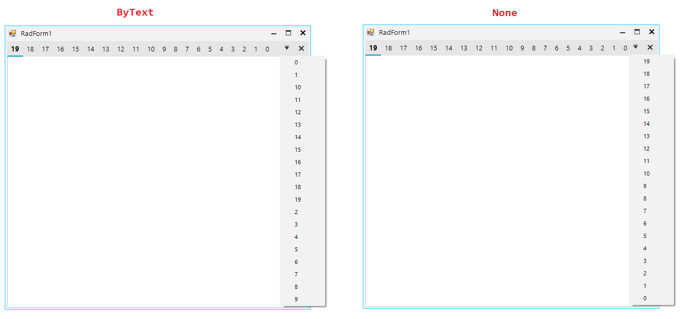

# Document Manager

The __DocumentManager__ object manages all **DockWindows** that are parented in the [main DocumentCountainer]() of __RadDock__. A Document (a window which is parented in a **DocumentContainer**) is either a **DocumentWindow** instance or a **ToolWindow**, that has its current **DockState** set to DockState.**TabbedDocument**. The **DocumentManager** exposes several important properties which will allow you to easily customize the way Documents behave in the **MainDocumentContainer**.
 
## ActiveDocument

This property allows you to get the currently active document among the documents in a __RadDock__ instance. This property is not equal to the __ActiveWindow__ property, because the currently active window can be a **ToolWindow**, but still there will be one document that is active among the rest of the documents. For example, in the screenshot below the ActiveWindow is *ToolWindow1*, but the **ActiveDocument** of **DocumentManager** is *DocumentWindow3*: 

        

#### Get the active DocumentWindow\ToolWindow 
{{source=..\SamplesCS\Dock\DocumentManager1.cs region=activeWindows}} 
{{source=..\SamplesVB\Dock\DocumentManager1.vb region=activeWindows}} 

````C#
DockWindow activeDocument = this.radDock1.DocumentManager.ActiveDocument; //documentWindow2
DockWindow activeWindow = this.radDock1.ActiveWindow; //toolWindow2
//set active window/document
this.radDock1.ActiveWindow = activeDocument;

````
````VB.NET
Dim activeDocument As DockWindow = Me.RadDock1.DocumentManager.ActiveDocument 'documentWindow2
Dim activeWindow As DockWindow = Me.RadDock1.ActiveWindow 'toolWindow2

````

{{endregion}} 

## BoldActiveDocument
 
Determines whether the currently active document's **Text** will be displayed in bold Font in its corresponding TabItem. The **ActiveDocument** in the screenshot below is *DocumentWindow2*, but its text is not bold due to setting the __BoldActiveDocument__ to *false*: 

#### Use the __BoldActiveDocument__ property

{{source=..\SamplesCS\Dock\DocumentManager1.cs region=boldActive}} 
{{source=..\SamplesVB\Dock\DocumentManager1.vb region=boldActive}} 

````C#
this.radDock1.DocumentManager.BoldActiveDocument = false;

````
````VB.NET
Me.RadDock1.DocumentManager.BoldActiveDocument = False

````

{{endregion}} 

## DocumentInsertOrder

Gets or sets the insert order to be used when adding new documents. By default, the insert order is set to *InFront* and the behavior resembles the behavior of VisualStudio. The screenshot below shows what happens after three clicks on the **Add Document** button when __DocumentInsertOrder__ is set to *Default* or *InFront*: 

#### Set the __DocumentInsertOrder__ property

{{source=..\SamplesCS\Dock\DocumentManager2.cs region=insertOrderInFront}} 
{{source=..\SamplesVB\Dock\DocumentManager2.vb region=insertOrderInFront}} 

````C#
this.radDock1.DocumentManager.DocumentInsertOrder = DockWindowInsertOrder.InFront;

````
````VB.NET
Me.RadDock1.DocumentManager.DocumentInsertOrder = DockWindowInsertOrder.InFront

````

{{endregion}} 

>caption Figure 1: New DocumentWindows are inserted before the first window.

 

The other available option for this property is *ToBack.* The behavior of **DocumentTabStrip** in this case resembles the behavior of most web browsers. The screenshot below demonstrates what happens after three clicks on the **AddDocument** button: 

#### Use the *ToBack* insert order

{{source=..\SamplesCS\Dock\DocumentManager2.cs region=insertOrderToBack}} 
{{source=..\SamplesVB\Dock\DocumentManager2.vb region=insertOrderToBack}} 

````C#
this.radDock1.DocumentManager.DocumentInsertOrder = DockWindowInsertOrder.ToBack;

````
````VB.NET
Me.RadDock1.DocumentManager.DocumentInsertOrder = DockWindowInsertOrder.ToBack

````

{{endregion}} 

>caption Figure 2: New Document windows are inserted after the first window.

 

#### ActiveDocumentMenuSortOrder

This property is an enumeration that Gets or sets the order of the document menu items that appear in the drop-down list. By default, they are alphabetically ordered. This property exposes the following values:

* __ByText__: (default value)  The items are sorted by the Text value of each document. 
* __None__: No sort order is applied. The items in the menu are in the order they appear in the owned documents.
* __ZOrdered__: The items are sorted by their z-order, supported by the DocumentManager.

In the following example, we are going to order the items by the order they are added in the document. This can be done by setting the __ActiveDocumentMenuSortOrder__ to __None__.

````C#
this.radDock1.DocumentManager.ActiveDocumentMenuSortOrder = ActiveDocumentMenuSortOrder.None;

````
````VB.NET
Me.RadDock1.DocumentManager.ActiveDocumentMenuSortOrder = ActiveDocumentMenuSortOrder.None

````

{{endregion}}

 
      
# See Also

* [Using the CommandManager]()     
* [Using the ContextMenuService]()
* [Using the DragDropService]() 
* [Understanding RadDock]()
