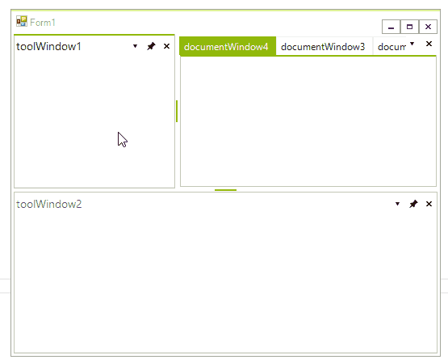
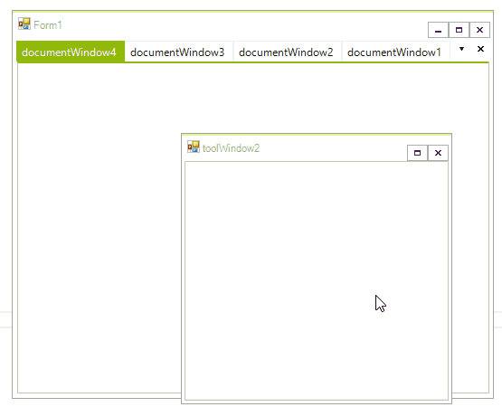
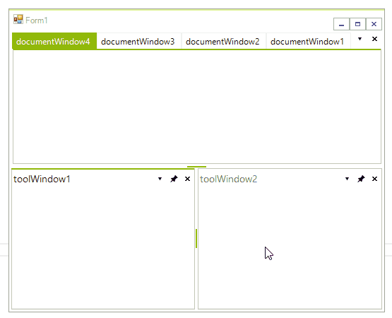
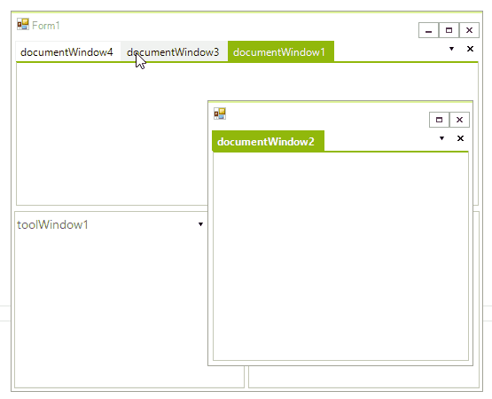

# Floating Windows

__ToolWindows__ can reside in docked or floating docking containers. Floating containers are still controlled by __RadDock__.
 
## Floating a ToolWindow

There are multiple ways to float a __ToolWindow__:

* Drag the __ToolWindow__ out of the docked container area to an existing floating container.

* Drag the __ToolWindow__ to any area within the __DockingAssistant__ other than a drop target icon, the __RadDock__ will create a new floating container with the __ToolWindow__ in it.
            
* Right click the __ToolWindow__ title bar and select __Floating__ from the context menu.
           
* Double-click the title bar.

## Moving a ToolWindow to an Existing Floating Window

You can drag __DockPanels__ to an existing floating container. Select left, right, top, or bottom drop targets to create a split-cell layout, just as you would with a docked container.  

>caption Figure 1: Dock window inside floating window.

 

## Unfloating a ToolWindow

To "un-float" a __ToolWindow__, drag the title bar to a docked container, or double-click the title bar.

## Moving a ToolWindow to a New Docking Container

If you use the drop target icons in the [DockingAssistant]() outer zone, the __RadDock__ will create a new docking container. The __ToolWindow__ that was in a floating container will fill the new docked container. 

>caption Figure 2: Re-Dock floating window.



## Moving a Floating ToolWindow to an Existing Container

If you use the drop target icons in the inner zone different than the fill option, the __RadDock__ will insert the __ToolWindow__ that was in the floating container into an new docked container. Then, it will rearrange other docking containers within that container to accommodate the new docking container, subject to any minimum or maximum size restrictions. 

>caption Figure 3: Moving a Floating ToolWindow to an Existing Container.


## Floating a document window

Document windows can also reside in a floating window. To make a document window float, drag its tab outside of any docking container. This will create a floating window with the document inside it.

>caption Figure 4: Floating a document window.



## Moving a document window to an existing floating window

You can drag document windows to an existing floating container. Select left, right, top, or bottom drop targets to create a split-cell layout or select the fill target to create a tab for the document in the existing document container.

>caption Figure 5: Moving a document window to an existing floating window.



## Changing the floating behavior

To enable the Visual Studio 2008-like docking behavior, set the __SingleScreen__ property to *true*. Enabling this property will prevent document windows from floating and from docking inside existing floating windows.
        

{{source=..\SamplesCS\Dock\ArchitectureAndFeatures.cs region=floatingTabsMode}} 
{{source=..\SamplesVB\Dock\ArchitectureAndFeatures.vb region=floatingTabsMode}} 

````C#
this.radDock1.SingleScreen = true;

````
````VB.NET
Me.RadDock1.SingleScreen = True

````

{{endregion}} 
 
## Properties

This section describes the FloatinWindows specific properties.
* __Standalone__: Allows the floating window to behave like separate form and appear in the taskbar.
* __SnapToScreen__: Indicates whether this window should snap to the screen's edges.
* __SnapToOthers__: Indicates whether this window should snap to other windows.
* __SnapThreshold__: Indicates whether the threshold between edges before the window snaps.
* __SnapOnResize__: Indicates whether this window should snap while resizing.
* __SnapOnMove__: Indicates whether this window should snap while dragging.

>note The snapping functionality can be enabled/disabled by using the __EnableFloatingWindowSnapping__ property of __RadDock__.
>

# See Also

* [Customizing Floating Windows]()
* [Using the CommandManager]()     
* [Using the ContextMenuService]()
* [Using the DragDropService]() 
* [Document Manager]()   
* [Understanding RadDock]()
