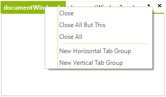
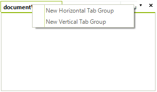

# Using the ContextMenuService
 
## Overview
 
All context menu related operations are handled by a stand alone service, registered with **RadDock** - **ContextMenuService**. Each context menu request is passed to the service, which on its hand creates the appropriate menu items and raises several events, which allows users to modify existing items, add their own or even cancel the request.
 
## Modifying the existing context menus
 
The following example demonstrates how you can hide the **Close** options from the **DocumentWindow** context menu. By default, the menu looks like this:

 
Let's get the **ContextMenuService** and subscribe to its **ContextMenuDisplaying** event:

#### Getting the ContextMenuService 

<snippet id='dock-using-the-contextmenuservice-gettingcontextmenuservice-cs' />
<snippet id='dock-using-the-contextmenuservice-gettingcontextmenuservice-vb' />

  

Then, hide the 'Close' options in the **ContextMenuDisplaying** event handler:

#### Hiding the 'close' menu items 

<snippet id='dock-using-the-contextmenuservice-handlingcontextmenudisplaying-cs' />
<snippet id='dock-using-the-contextmenuservice-handlingcontextmenudisplaying-vb' />

 
 
The result is shown on the screenshot below:

 
## Menu items' names 

You can notice in the code snippet above that we are using the __Name__ property of the items instead of the __Text__ property. This allows you to handle the case even when a custom [RadDockLocalization]() provider is applied. The names for the menu items in **RadDock** are:
 
| __Text__ | __Name__ |
|----|----|
|Close|CloseWindow|
|Close All But This|CloseAllButThis|
|Close All|CloseAll|
|New Horizontal Tab Group|NewHTabGroup|
|New Vertical Tab Group|NewVTabGroup|
|Floating|Floating|
|Dockable|Docked|
|Tabbed Document|TabbedDocument|
|Auto Hide|AutoHide|
|Hide|Hidden|
| *Document Name* |ActivateWindow|

# See Also

[Getting Started]()
[Using the CommandManager]() 
[Understanding RadDock]()
[Using the DragDropService]() 
[Document Manager]()   
