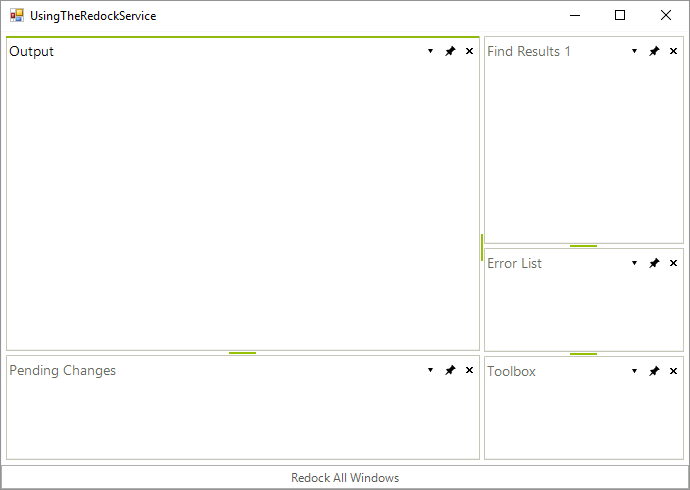
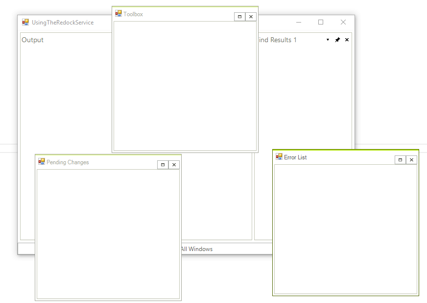

# Using the RedockService

**RedockService** comes in handy when you want to save the dock state of your **DockWindows** and restore this state later.

## Using the RedockService

Let's take a look at the following scenario: 
         
1. We have a __RadDock__ instance containing several docked **ToolWindows** as shown below:        
	

1. The end-user decides to float some of the **ToolWindows**:
	

1. Now comes the time when the user wants to re-dock the floating **ToolWindows**. However, the user does not only want to dock the **ToolWindows**, he/she want to achieve the layout that he/she had at the beginning. For that purpose, we can have a button or a menu item on the **Click** of which we get the **RedockService** and return the floating windows to their original docked state by calling the __RestoreMethod__ of the service. When the user clicks that button, he/she will get the layout below, which as you can see is the same as the layout that we had at the beginning:
   
<snippet id='dock-using-the-redockservice-redockservice-cs' />
<snippet id='dock-using-the-redockservice-redockservice-vb' />

 
 

## See Also
* [Getting Started]()
* [Using the CommandManager]()
* [Using the ContextMenuService]()
* [Using the DragDropService]()
* [Document Manager]()
* [Understanding RadDock]()
