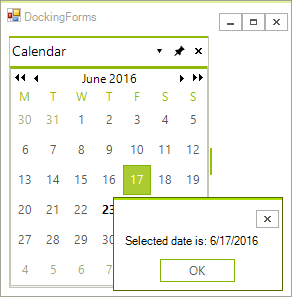

# Docking a UserControl with custom event
 
This tutorial walks you through a real-world scenario that you can have in your application. At a high level, this scenario involves:

1. Docking the user controls inside **RadDock**.

1. Implementing events, methods and properties in the user controls which allow you to have communication between the forms/user controls.

In our particular case we dock a user control instance inside a __RadDock__ instance. The user control itself contains a __RadCalendar__. When the user clicks the __RadCalendar__ a custom __DateChanged__ event for the **UserControl1** fires, showing a dialog with the selected date. Using this as a model you can create **UserControls** with custom properties, methods and events for more complex situations.


 
1\. In Visual Studio create a new Windows Application.

2\. Create a new UserControl - from the Solution Explorer, right-click the project node in the Solution Explorer and select "*Add >> UserControl...*". Name the new user control __CalendarPanel__.

3\. Drop a __RadCalendar__ on the __CalendarPanel__ design surface.

4\. Set the RadCalendar.__Dock__ property to *Fill*.

5\. In the **Property Window** locate the __SelectionChanged__ event and double-click it to create an event handler.

6\. Add a delegate and event to be surfaced by the **CalendarPanel** control when the date selection changes:
	
#### Setting up DateChanged Event 

{{source=..\SamplesCS\Dock\CalendarPanel.cs region=definingDelegates}} 
{{source=..\SamplesVB\Dock\CalendarPanel.vb region=definingDelegates}} 

````C#
public delegate void DateChangedHandler(DateTime date);
public event DateChangedHandler DateChanged;

````
````VB.NET
Public Delegate Sub DateChangedHandler(ByVal [date] As DateTime)
Public Event DateChanged As DateChangedHandler

````

{{endregion}} 

In the __SelectionChanged__ event handler add the following code:

#### Handling the RadCalendar SelectionChanged event 

{{source=..\SamplesCS\Dock\CalendarPanel.cs region=handlingSelectionChanged}} 
{{source=..\SamplesVB\Dock\CalendarPanel.vb region=handlingSelectionChanged}} 

````C#
private void radCalendar1_SelectionChanged(object sender, EventArgs e)
{
    if (DateChanged != null)
    {
        DateChanged((sender as Telerik.WinControls.UI.RadCalendar).SelectedDate);
    }
}

````
````VB.NET
Private Sub RadCalendar1_SelectionChanged(ByVal sender As System.Object, ByVal e As System.EventArgs) Handles RadCalendar1.SelectionChanged
    RaiseEvent DateChanged((TryCast(sender, RadCalendar)).SelectedDate)
End Sub

````

{{endregion}} 

7\. In the Solution Explorer, double-click the main form to open its design surface.  

8\. Drop a __RadDock__ on the opened design surface. Set the __Dock__ property to *Fill.*

9\. Dock the __CalendarPanel__ user control to __RadDock__ in the form's **Load** event handler using the following code snippet:
	
#### Docking CalendarPanel user control in RadDock 

{{source=..\SamplesCS\Dock\DockingForms.cs region=creatingCalendarPanel}} 
{{source=..\SamplesVB\Dock\DockingForms.vb region=creatingCalendarPanel}} 
	
````C#
CalendarPanel calendarPanel = new CalendarPanel();
HostWindow host = this.radDock1.DockControl(calendarPanel, Telerik.WinControls.UI.Docking.DockPosition.Left);
host.Text = "Calendar";
calendarPanel.DateChanged += calendarPanel_DateChanged;

````
````VB.NET
Dim calendarPanel As New CalendarPanel()
Dim host As HostWindow = Me.RadDock1.DockControl(calendarPanel, Telerik.WinControls.UI.Docking.DockPosition.Left)
host.Text = "Calendar"
AddHandler calendarPanel.DateChanged, AddressOf calendarPanel_DateChanged

````

{{endregion}} 
 
10\. Add an event handler for the CalendarPanel **DateChanged** event:
	
#### Handling the Custom DateChanged event 

{{source=..\SamplesCS\Dock\DockingForms.cs region=handlingDateChanged}} 
{{source=..\SamplesVB\Dock\DockingForms.vb region=handlingDateChanged}} 

````C#
void calendarPanel_DateChanged(DateTime date)
{
    RadMessageBox.Show("Selected date is: " + date.ToShortDateString());
}

````
````VB.NET
Sub calendarPanel_DateChanged(ByVal [date] As DateTime)
    RadMessageBox.Show("Selected date is: " + [date].ToShortDateString())
End Sub

````

{{endregion}} 
 
11\. Press __F5__ to run the application. Click the cells in the calendar to display the date in a message dialog. 

# See Also
* [Getting Started]()
* [Docking Singleton Forms]()
* [Get a HostWindow by its Content]() 
