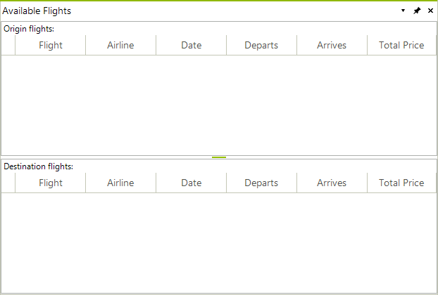
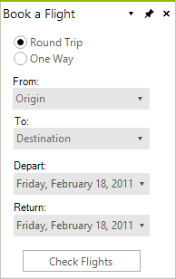
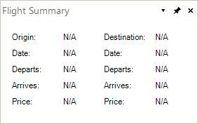
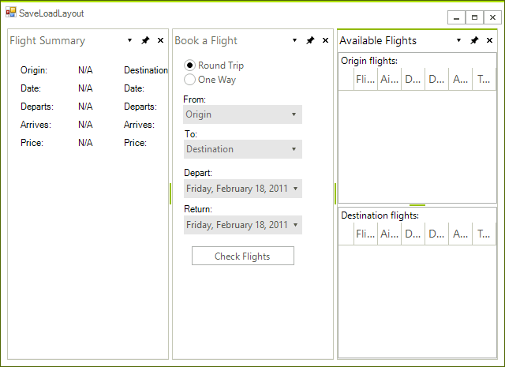
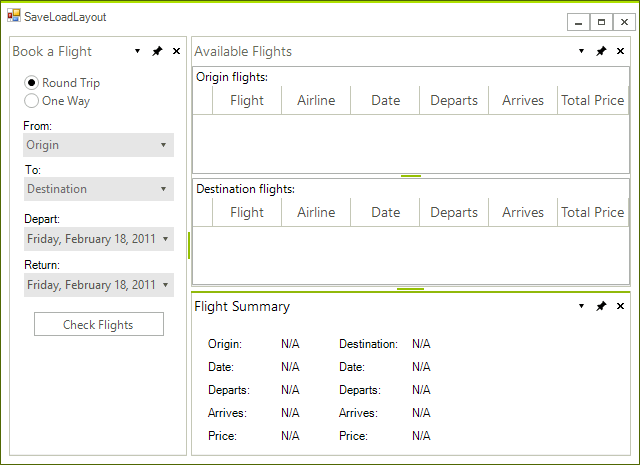
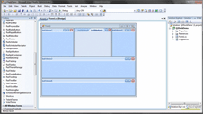

# Tutorial: Saving and Loading Layout and Content

As stated in [this documentation article]() __RadDock__ can save and then load the layout of its **DockWindows**. However, this mechanism does not save the content of these windows. The purpose of this article is to demonstrate what approach you should follow when you want to restore not only the layout of the **DockWindows**, but their content as well.
      
## Example: Saving and Loading layout and content

1\. Usually, each **DockWindow** contains a set of controls. To make the task of saving and loading the content easier, let's put this content in **UserControls**.

>caption Figure 1: Three UserControls containing different controls.

2\. Then, let's define the path to the xml file where we will save our layout: 

<snippet id='dock-tutorial-saving-and-loading-layout-and-content-paths-cs' />
<snippet id='dock-tutorial-saving-and-loading-layout-and-content-paths-vb' />

 
 
3\. At the **Load** event of our form we will check if the xml file with the saved layout exists. If the file exists at the specified location, we will load the layout as shown in the next paragraphs. If it does not exists, we will create a generic layout in **RadDock** loading our user controls: 

<snippet id='dock-tutorial-saving-and-loading-layout-and-content-formload-cs' />
<snippet id='dock-tutorial-saving-and-loading-layout-and-content-formload-vb' />

 

Please note that the names of the types of the **UserControls** are important, because these names will actually give the names of the **HostWindows** that will be created to host the **UserControls**. The names of the **HostWindows** will be later used during the process of loading the content.

4\. Let's now arrange the dock window in a more user friendly way:

5\. Now close the form containing RadDock. The **FormClosing** event handler is a convenient place to save our layout: 

<snippet id='dock-tutorial-saving-and-loading-layout-and-content-formclosing-cs' />
<snippet id='dock-tutorial-saving-and-loading-layout-and-content-formclosing-vb' />

 
 
6\. Reopen the form. Since the XML file defined at paragraph two now exists, our layout and content will be loaded with the help of the following methods:
            
* __LoadFromXml:__ This method will create **HostWindows** and will arrange them according to the information saved in the XML file.               

* __LoadContent:__ This is our custom method which loads the content in the created **HostWindows**. Note that the different user controls are loaded in the appropriate **HostWindows** depending on the names of these windows. 

<snippet id='dock-tutorial-saving-and-loading-layout-and-content-loadcontent-cs' />
<snippet id='dock-tutorial-saving-and-loading-layout-and-content-loadcontent-vb' />

 
 
As a result we get the layout shown on the screenshot below:

| RELATED VIDEOS |  |
| ------ | ------ |
|[Saving and Loading RadDock for WinForms Layouts](http://www.telerik.com/videos/winforms/saving-and-loading-raddock-for-winforms-layouts) In this video, you will learn how to use the simple XML serialization features of RadDock for WinForms to easily save and load RadDock layouts. (Runtime: 07:03)||

# See Also

* [Loading And Saving Layouts]()
