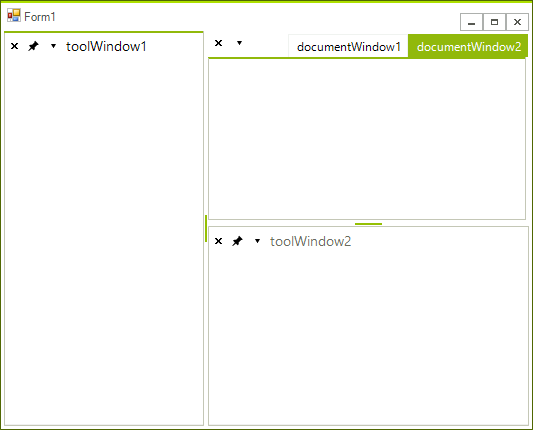

# Right-to-left support
 
You can present the content of your dock instance in a right-to-left direction by setting the __RightToLeft__ property to *Yes*: 

<snippet id='dock-right-to-left-support-rtl-cs' />
<snippet id='dock-right-to-left-support-rtl-vb' />

 

# See Also

* [Localization]()
