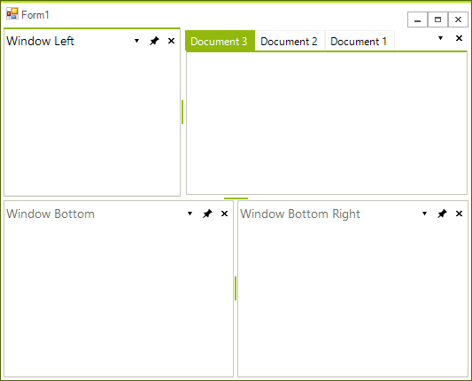
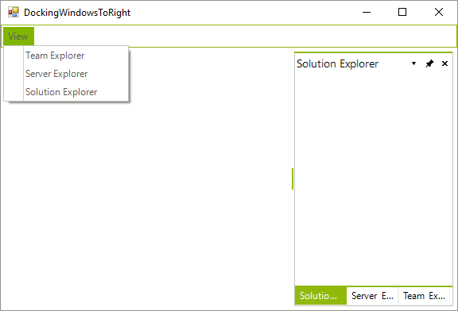
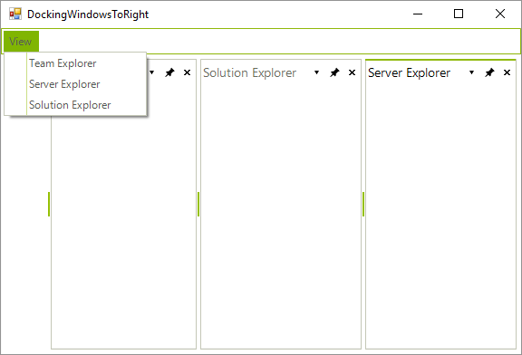

# Creating ToolWindow and DocumentWindow at Runtime
 
## Creating ToolWindow at Runtime

To create a new __ToolWindow__, construct a __ToolWindow__ instance, set properties and call the __DockWindow()__ method, passing a reference to the __ToolWindow__ and a __DockPosition__ enumeration value.

#### Creating a ToolWindow 

<snippet id='dock-creating-toolwindow-and-documentwindow-at-runtime-creatingtoolwindow-cs' />
<snippet id='dock-creating-toolwindow-and-documentwindow-at-runtime-creatingtoolwindow-vb' />

## Creating DocumentWindow at Runtime

To create a __DocumentWindow__, construct an instance of __DocumentWindow__, assign properties and call the __AddDocument__ method, passing the __DocumentWindow__ instance.

#### Creating a DocumentWindow 

<snippet id='dock-creating-toolwindow-and-documentwindow-at-runtime-creatingdocumentwindow-cs' />
<snippet id='dock-creating-toolwindow-and-documentwindow-at-runtime-creatingdocumentwindow-vb' />

## Example: Creating Multiple ToolWindow and DocumentWindow at Runtime

The following example creates multiple panels and document panes at runtime.

#### Creating ToolWindows and DocumentWindows 

<snippet id='dock-creating-toolwindow-and-documentwindow-at-runtime-wininitialization-cs' />
<snippet id='dock-creating-toolwindow-and-documentwindow-at-runtime-wininitialization-vb' />

## Creating and docking multiple windows in a single strip

There are cases in which you might prefer docking two or more windows to the right edge of __RadDock__ only, so that these right-edged windows are tabbed in a single container. For example, let’s say that we have `Team Explorer`, `Solution Explorer` and `Server Explorer` windows and they are all initially closed. We also have a menu that allows us to open these windows, and after clicking all the corresponding menu items we want to get this picture:

The bellow code shows how you can create each one of the windows:

<snippet id='dock-creating-toolwindow-and-documentwindow-at-runtime-wrongapproach-cs' />
<snippet id='dock-creating-toolwindow-and-documentwindow-at-runtime-wrongapproach-vb' />

However, this API docks the windows to right of **RadDock**, not taking into consideration other right-docked windows:

So, we need to follow another approach. What we need to do is to globally define a **ToolTabStrip** variable that would be set the first time a window is right-docked. Then, the next time we dock a window, we will do it in the context of the already created **ToolTabStrip**. Here is what should be done in code on click of the menu items:

<snippet id='dock-creating-toolwindow-and-documentwindow-at-runtime-menuitemsclick-cs' />
<snippet id='dock-creating-toolwindow-and-documentwindow-at-runtime-menuitemsclick-vb' />

# See Also

* [AllowedDockStates]()
* [Creating a RadDock at Runtime]()
* [Accessing DockWindows]()
* [Customizing Floating Windows]()
* [Customizing TabStrip Items]()
* [Building an Advanced Layout at Runtime]()
* [RadDock Properties and Methods]()
* [Removing ToolWindow and DocumentWindow at Runtime]()
* [Tabs and Captions]()
* [ToolWindow and DocumentWindow Properties and Methods]()
* [Tracking the ActiveWindow]()
