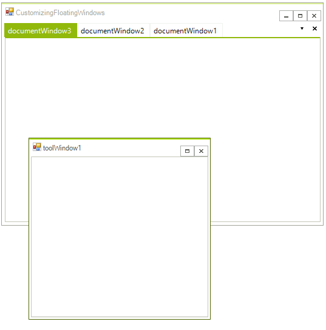
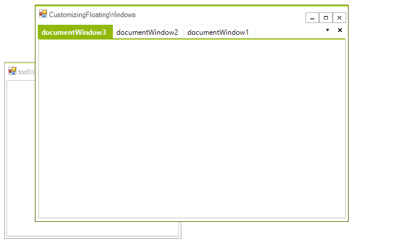
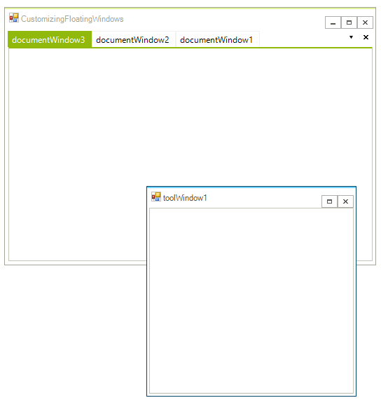

# Customizing Floating Windows
 
__FloatingWindows__ provide a useful way of reordering pieces of content on your screen. By default, **FloatingWindows** only appear with their close button enabled, and on top of the __RadDock__ that manages them. The following paragraphs demonstrate how this behavior can be changed. In all cases you need to handle the __FloatingWindowCreated__ event which is fired after the end-user starts dragging a **ToolWindow** to float it. At this point the **FloatingWindow** is created and it is just about to be shown. This is the moment when you can plug in and modify the window your way.

## Enabling Minimize and Maximize buttons  

In order to enable the `Maximize` and `Minimize` buttons for a **FloatingWindow**, you have to handle the `FloatingWindowCreated` event and set the **MinimizeBox**, **MaximizeBox** and **FormBorderStyle** properties of the **FloatingWindow** the following way: 

<snippet id='dock-customizing-floating-windows-buttons-cs' />
<snippet id='dock-customizing-floating-windows-buttons-vb' />

 
 
The result is:

## Allowing the FloatingWindow to be under the main form

Sometimes, you may want to prevent the **FloatingWindow** from being always on top of the form that contains the **RadDock** manager. In order to do that, you need to extend the **FloatingWindow** class and use an instance of the extended type. 
In the extended **FloatingWindow** type, we need to override the **OnActivated** method, and after the base implementation takes place, we should remove the window from the collection of owned forms that the main form has: 

<snippet id='dock-customizing-floating-windows-customfloatingwindow-cs' />
<snippet id='dock-customizing-floating-windows-customfloatingwindow-vb' />

 
 
Finally, we have to pass an instance of the custom **FloatingWindow** to the event arguments of the **FloatingWindowCreated** event: 

<snippet id='dock-customizing-floating-windows-showbehind-cs' />
<snippet id='dock-customizing-floating-windows-showbehind-vb' />

 
 

Here is the result. As you can see, the form that contains the **RadDock** manager can cover the **FloatingWindow**:

## Setting the theme of a FloatingWindow

**FloatingWindow** is a descendant class of **RadForm**. As such, **FloatingWindow** has the __ThemeName__ property that you can set in the **FloatingWindowCreated** event in order to change its theme: 

<snippet id='dock-customizing-floating-windows-themename-cs' />
<snippet id='dock-customizing-floating-windows-themename-vb' />

 

# See Also

* [AllowedDockStates]()
* [Creating a RadDock at Runtime]()
* [ Creating ToolWindow and DocumentWindow at Runtime]()
* [Customizing Floating Windows]()
* [Accessing DockWindows]()
* [Building an Advanced Layout at Runtime]()
* [RadDock Properties and Methods]()
* [Removing ToolWindow and DocumentWindow at Runtime]()
* [Tabs and Captions]()
* [ToolWindow and DocumentWindow Properties and Methods]()
* [Tracking the ActiveWindow]()
