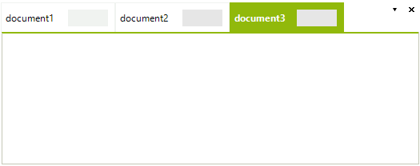
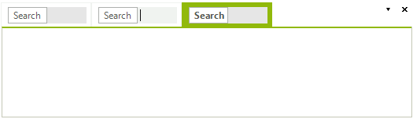
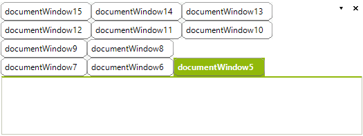

# Customizing TabStrip Items
 
This article demonstrates how you can customize or replace the **TabStrip** items.

##  Using the TabStripItemCreating event
      

The above examples are using the __TabStripItemCreating__ event. This event cannot be accessed via the **RadDock** instance. You can subscribe to the event by using the static __RadDockEvents__ class. You should do that before the **InitializeComponent** method call: 

<snippet id='dock-customizing-tabstrip-items-subscribe-cs' />
<snippet id='dock-customizing-tabstrip-items-subscribe-vb' />

 

Please note that when such static events are used it is mandatory to unsubscribe from the event. If you do not do that the form would not be disposed properly: 

<snippet id='dock-customizing-tabstrip-items-closed-cs' />
<snippet id='dock-customizing-tabstrip-items-closed-vb' />

 
## Adding element to the TabStrip item

The **TabStripItemCreating** event can be used for adding any kind of **RadElements** to the **TabStrip**. For example, the following code adds text box to each **TabStrip** item: 

<snippet id='dock-customizing-tabstrip-items-element-cs' />
<snippet id='dock-customizing-tabstrip-items-element-vb' />

 
 
The tabs will look like this:

## Replacing the entire TabStrip element.

The **TabStripItemCreating** event can be used for replacing the entire element as well. First you need to create a **TabStripItem** class descendant 

<snippet id='dock-customizing-tabstrip-items-item-cs' />
<snippet id='dock-customizing-tabstrip-items-item-vb' />

 
 
Then you can just replace the default item: 

<snippet id='dock-customizing-tabstrip-items-replace-cs' />
<snippet id='dock-customizing-tabstrip-items-replace-vb' />

 
 
The tabs will look like in the following image:

## DocumentTabStrip Multi Line Row Layout with a Custom Tab Shape
      
The tab items of the __DocumentWindows__ in __RadDock__ have a predefined shape applied (*TabVsShape*). The following example will demonstrate how the default layout can be modified so the tabs are displayed in a multi row layout and how a custom shape can be applied to the tab items. For the purpose we have to subscribe to the static __TabStripItemCreating__ event (where we will change the __Shape__ property) and access the __DocumentTabStrip__ in order to set the desired __StripViewItemFitMode__.
        

>note Since the __TabStripItemCreating__ event is static the event subscription have to be defined before the call to the InitializeComponent method.
> 

<snippet id='dock-customizing-tabstrip-items-multilinerowlayoutinit-cs' />
<snippet id='dock-customizing-tabstrip-items-multilinerowlayoutinit-vb' />

  

>note Because we are subscribing to a static event, we need to take care of the unscibription as well. Otherwise the form would not be disposed properly.
> 

<snippet id='dock-customizing-tabstrip-items-closed-cs' />
<snippet id='dock-customizing-tabstrip-items-closed-vb' />

Here is the outcome of the code above:

# See Also

* [AllowedDockStates]()
* [Creating a RadDock at Runtime]()
* [ Creating ToolWindow and DocumentWindow at Runtime]()
* [Customizing Floating Windows]()
* [Accessing DockWindows]()
* [Building an Advanced Layout at Runtime]()
* [RadDock Properties and Methods]()
* [Removing ToolWindow and DocumentWindow at Runtime]()
* [Tabs and Captions]()
* [ToolWindow and DocumentWindow Properties and Methods]()
* [Tracking the ActiveWindow]()
