# Example: Building an advanced layout at runtime
 
In this tutorial we are going to create an advanced layout of __ToolWindows__ and __DocumentWindows__ programmatically. Our aim is to build the layout shown on the screenshot below:

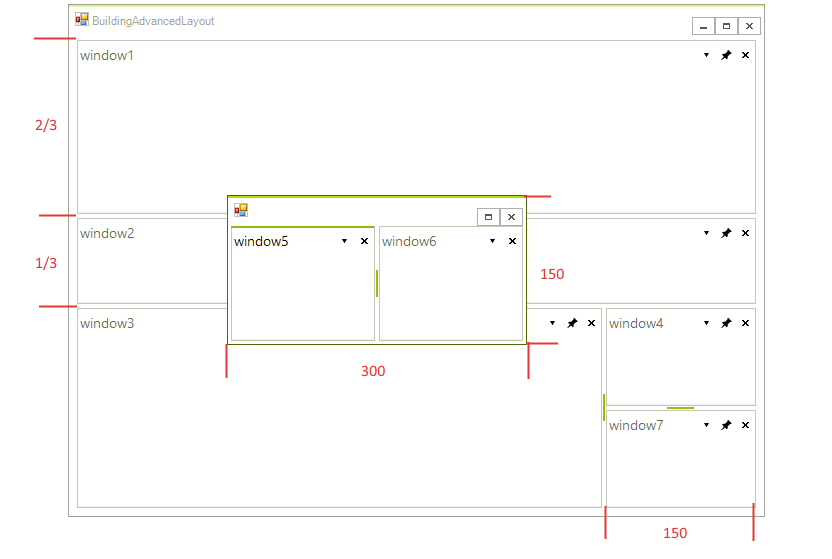

We will have a floating window with two **ToolWindows** and dimensions of the floating window 150 height and 300 width. An interesting part of building the layout is using the __SizeInfo__ property of the **TabStrip** containers. This property gives you:

* The ability to set a precise size of a **TabStrip** which will not be changed when a user resizes the whole __RadDock__ control. For example, the **TabStrip** of `window7` will not be resized when we resize the whole form. Its width will always be 150 unless we explicitly resize the **TabStrip** of the `window7` by using the splitter. 

* The ability to set a relative size of a **TabStrip** so to keep two **TabStrips** in a specific size ratio. When we resize the form, the **TabStrips** of `window1` and `window2` will keep the ration of 1:2 between them - the **TabStrip** of `window2` having 1/3 parts and the **TabStrip** of `window1` having 2/3 parts. 

So, let's start building the layout:

1\. First, let's drag and drop a __RadDock__ instance on our form. Set the __Dock__ property to *Fill*. Subscribe to the **Load** event which we will use to implement our windows layout.

2\. Next, we are going to make to **ToolWindows**. The first one will be docked left, and the other will be docked left-bottom. For this case we need to give the first **ToolWindow** as a target in the **DockWindow** method responsible for docking the second **ToolWindow**:

#### Docking two ToolWindows 

{{source=..\SamplesCS\Dock\BuildingAdvancedLayout.cs region=dockingTwoToolWindows}} 
{{source=..\SamplesVB\Dock\BuildingAdvancedLayout.vb region=dockingTwoToolWindows}} 

````C#
ToolWindow window1 = new ToolWindow();
window1.Name = "window1";
this.radDock1.DockWindow(window1, DockPosition.Left);
ToolWindow window2 = new ToolWindow();
window2.Name = "window2";
this.radDock1.DockWindow(window2, window1, DockPosition.Bottom);

````
````VB.NET
Dim window1 As ToolWindow = New ToolWindow()
window1.Name = "window1"
Me.RadDock1.DockWindow(window1, DockPosition.Left)
Dim window2 As ToolWindow = New ToolWindow()
window2.Name = "window2"
Me.RadDock1.DockWindow(window2, window1, DockPosition.Bottom)

````

{{endregion}} 

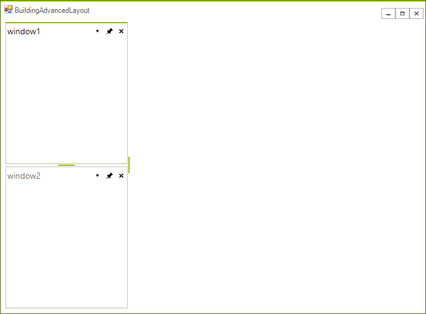

3\. Next, let's make the height of `window2` relative to the height of the `window1`:

#### Setting relative size 

{{source=..\SamplesCS\Dock\BuildingAdvancedLayout.cs region=settingRelativeSize}} 
{{source=..\SamplesVB\Dock\BuildingAdvancedLayout.vb region=settingRelativeSize}} 

````C#
window2.TabStrip.SizeInfo.SizeMode = SplitPanelSizeMode.Relative;
window2.TabStrip.SizeInfo.RelativeRatio = new SizeF(0, 0.33f);

````
````VB.NET
window2.TabStrip.SizeInfo.SizeMode = SplitPanelSizeMode.Relative
window2.TabStrip.SizeInfo.RelativeRatio = New System.Drawing.SizeF(0, 0.33F)

````

{{endregion}} 
 
The result is shown on the picture below:

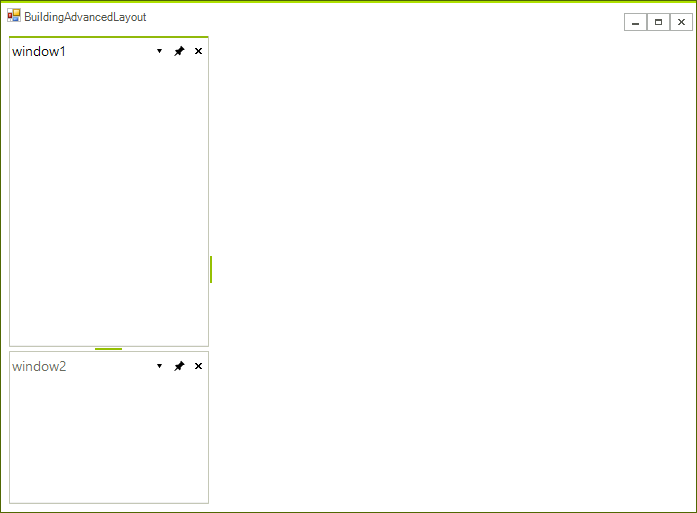

Now, if we decide to resize the form, the ration of the **TabStrips**' height will be kept:

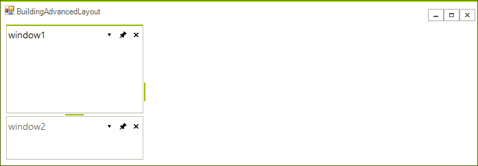
 
4\. Let's add two more windows:

#### Setting absolute size 

{{source=..\SamplesCS\Dock\BuildingAdvancedLayout.cs region=settingAbsoliteSize}} 
{{source=..\SamplesVB\Dock\BuildingAdvancedLayout.vb region=settingAbsoliteSize}} 

````C#
ToolWindow window3 = new ToolWindow();
window3.Name = "window3";
this.radDock1.DockWindow(window3, DockPosition.Bottom);
ToolWindow window4 = new ToolWindow();
window4.Name = "window4";
this.radDock1.DockWindow(window4, window3, DockPosition.Right);
window4.TabStrip.SizeInfo.SizeMode = SplitPanelSizeMode.Absolute;
window4.TabStrip.SizeInfo.AbsoluteSize = new Size(150, 0);

````
````VB.NET
Dim window3 As ToolWindow = New ToolWindow()
window3.Name = "window3"
Me.RadDock1.DockWindow(window3, DockPosition.Bottom)
Dim window4 As ToolWindow = New ToolWindow()
window4.Name = "window4"
Me.RadDock1.DockWindow(window4, window3, DockPosition.Right)
window4.TabStrip.SizeInfo.SizeMode = SplitPanelSizeMode.Absolute
window4.TabStrip.SizeInfo.AbsoluteSize = New Size(150, 0)

````

{{endregion}} 
 
This time we set the __Width__ of the `window4` to an absolute value of 150 pixels.  

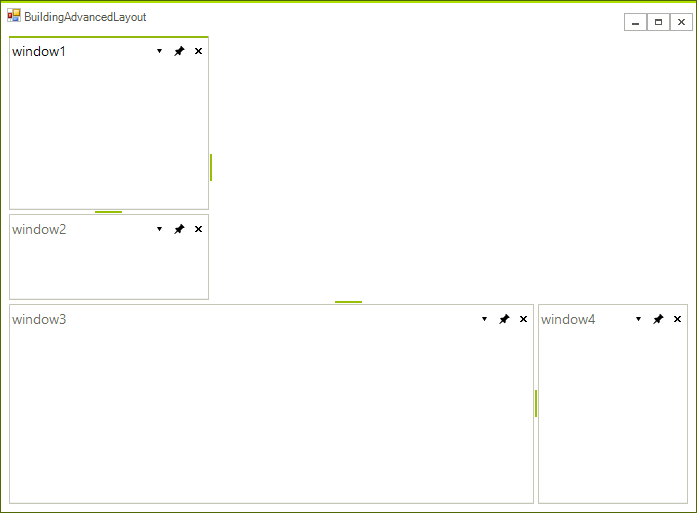

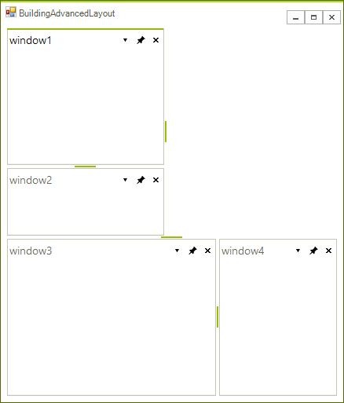

5\. Add two more **ToolWindows**. The interesting thing here is that these **ToolWindows** will be in a __Floating__ *DockState*. Please note that you can give the size and location of the form that will host the **ToolWindows**.

#### Floating ToolWindows 

{{source=..\SamplesCS\Dock\BuildingAdvancedLayout.cs region=floatingWindows}} 
{{source=..\SamplesVB\Dock\BuildingAdvancedLayout.vb region=floatingWindows}} 
	
````C#
ToolWindow window5 = new ToolWindow();
window5.Name = "window5";
this.radDock1.FloatWindow(window5, new Rectangle(250, 250, 300, 150));
ToolWindow window6 = new ToolWindow();
window6.Name = "window6";
this.radDock1.DockWindow(window6, window5, DockPosition.Right);

````
````VB.NET
Dim window5 As ToolWindow = New ToolWindow()
window5.Name = "window5"
Me.RadDock1.FloatWindow(window5, New Rectangle(250, 250, 300, 150))
Dim window6 As ToolWindow = New ToolWindow()
window6.Name = "window6"
Me.RadDock1.DockWindow(window6, window5, DockPosition.Right)

````

{{endregion}} 

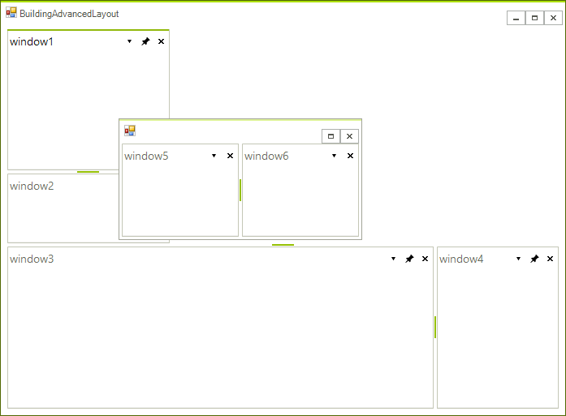 

6\. We will add one more **ToolWindow**. The specific thing here is that although the **ToolWindow** should be auto-hidden to `Bottom` if the user decides to click the `Pin` button, this window will be auto-hidden to top. This is done with the help of __AutoHidePosition__ property of the **TabStrip** which hosts the **ToolWindow**. In addition, this auto-hidden window will have a specific size of (200, 200). Since the __AutoHidePosition__ is set to *Top*, **Height** of the given size will be taken into consideration:

#### Setting the AutoHidePosition and AutoHideSize properties 

{{source=..\SamplesCS\Dock\BuildingAdvancedLayout.cs region=autoHide}} 
{{source=..\SamplesVB\Dock\BuildingAdvancedLayout.vb region=autoHide}} 

````C#
ToolWindow window7 = new ToolWindow();
window7.Name = "window7";
window7.AutoHideSize = new Size(100, 100);
this.radDock1.DockWindow(window7, window4, DockPosition.Bottom);
((ToolTabStrip)window7.TabStrip).AutoHidePosition = AutoHidePosition.Top;

````
````VB.NET
Dim window7 As ToolWindow = New ToolWindow()
window7.Name = "window7"
window7.AutoHideSize = New Drawing.Size(100, 100)
Me.RadDock1.DockWindow(window7, window4, DockPosition.Bottom)
CType(window7.TabStrip, ToolTabStrip).AutoHidePosition = AutoHidePosition.Top

````

{{endregion}}  

Initially, the layout will look like this:

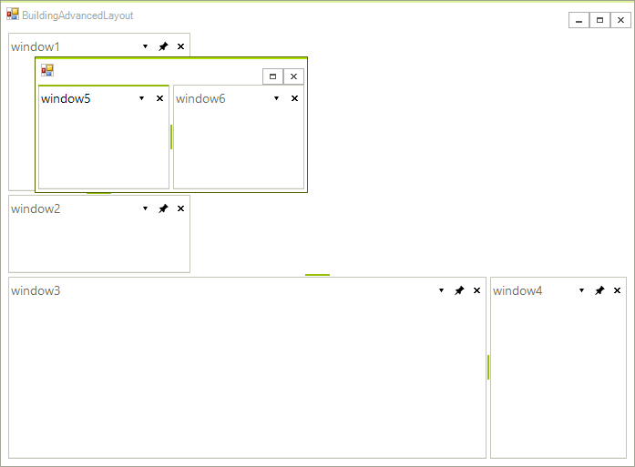 

If the user clicks the `Pin` button of `window7`, it will become auto-hidden to the top. Next, when the user hovers the `window7` tab, a window with 100 pixels in height is shown:

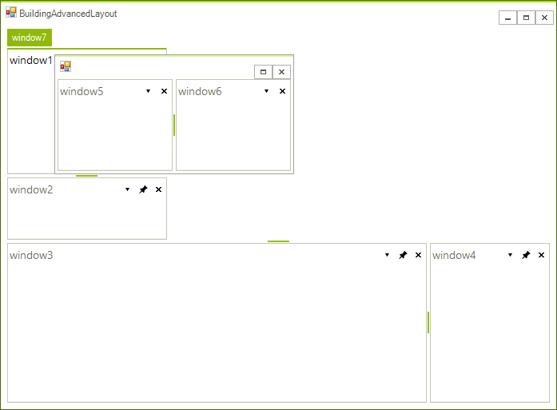

7\. Finally, we should decide if we want to show several **DocumentWindows**. If yes, we can add them as shown below:

#### Adding DocumentWindows 

{{source=..\SamplesCS\Dock\BuildingAdvancedLayout.cs region=addingDocumentWindows}} 
{{source=..\SamplesVB\Dock\BuildingAdvancedLayout.vb region=addingDocumentWindows}} 

````C#
DocumentWindow document1 = new DocumentWindow();
document1.Name = "document1";
this.radDock1.AddDocument(document1);
DocumentWindow document2 = new DocumentWindow();
document2.Name = "document2";
this.radDock1.AddDocument(document2, document1, DockPosition.Bottom);

````
````VB.NET
Dim document1 As DocumentWindow = New DocumentWindow()
document1.Name = "document1"
Me.RadDock1.AddDocument(document1)
Dim document2 As DocumentWindow = New DocumentWindow()
document2.Name = "document2"
Me.RadDock1.AddDocument(document2, document1, DockPosition.Bottom)

````

{{endregion}} 


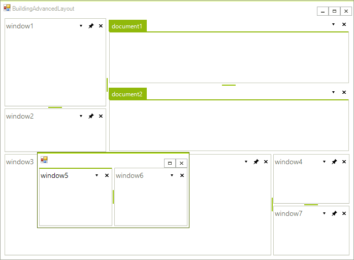

However, you may not want to have any documents. In this case, set the __MainDocumentContainerVisible__ property to *false*:

#### Hiding the main DocumentContainer 

{{source=..\SamplesCS\Dock\BuildingAdvancedLayout.cs region=dockContainerVisible}} 
{{source=..\SamplesVB\Dock\BuildingAdvancedLayout.vb region=dockContainerVisible}} 

````C#
this.radDock1.MainDocumentContainerVisible = false;

````
````VB.NET
Me.RadDock1.MainDocumentContainerVisible = False

````

{{endregion}} 

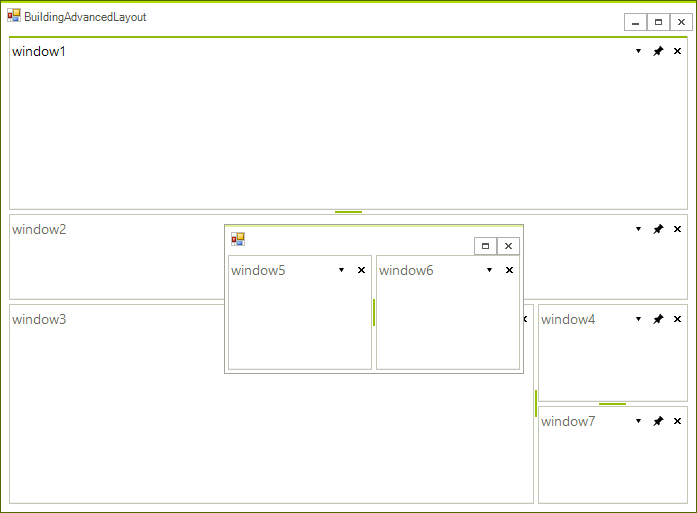

# See Also

* [AllowedDockStates]()
* [Creating a RadDock at Runtime]()
* [ Creating ToolWindow and DocumentWindow at Runtime]()
* [Customizing Floating Windows]()
* [Customizing TabStrip Items]()
* [Accessing DockWindows]()
* [RadDock Properties and Methods]()
* [Removing ToolWindow and DocumentWindow at Runtime]()
* [Tabs and Captions]()
* [ToolWindow and DocumentWindow Properties and Methods]()
* [Tracking the ActiveWindow]()
