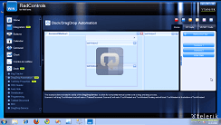
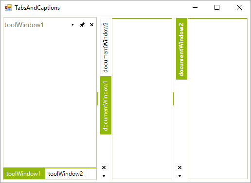
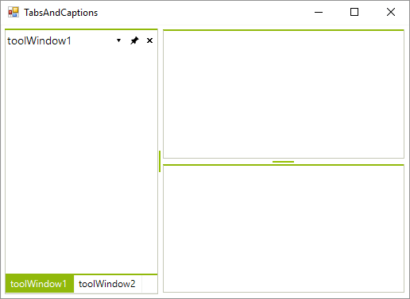
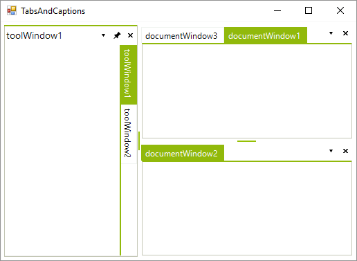
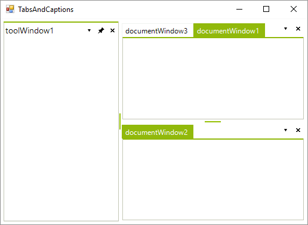
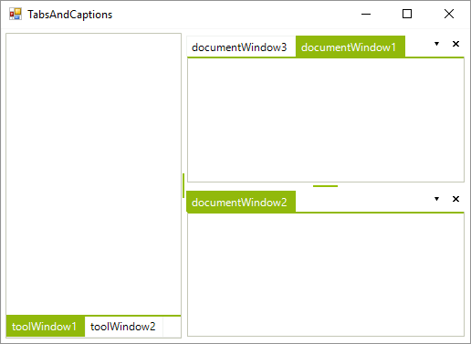
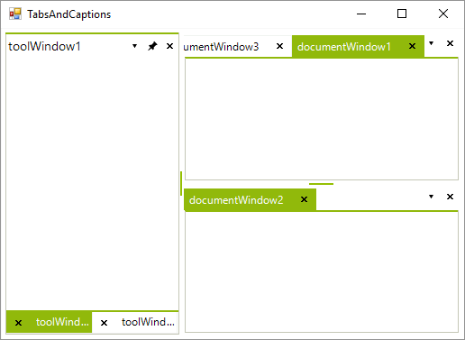

# Tabs and Captions
 
| RELATED VIDEOS |  |
| ------ | ------ |
|[RadDock Tab Alignment/Visibility and Automation](http://tv.telerik.com/watch/winforms/raddock/raddock-tab-alignmentvisibility-automation)In this video, you will learn about some of the new features provided in the R3 2009 release of the RadDock. These features include tab alignment and visibility as well as drag and drop automation.||

__RadDock__ exposes several properties which allow you to have full control over the visibility and the position of the tabs/captions:

* __DocumentTabAlignment:__ defines the position of the tabs for all `DocumentTabStrip` instances in __RadDock__.

#### Setting DocumentTabsAlignment to Left 

{{source=..\SamplesCS\Dock\TabsAndCaptions.cs region=documentTabsAlignment}} 
{{source=..\SamplesVB\Dock\TabsAndCaptions.vb region=documentTabsAlignment}} 

````C#
this.radDock1.DocumentTabsAlignment = TabStripAlignment.Left;

````
````VB.NET
Me.RadDock1.DocumentTabsAlignment = TabStripAlignment.Left

````

{{endregion}} 




* __DocumentTabsVisible:__ allows you to hide/show all document tabs:

#### Hiding the document tabs 

{{source=..\SamplesCS\Dock\TabsAndCaptions.cs region=documentTabsVisible}} 
{{source=..\SamplesVB\Dock\TabsAndCaptions.vb region=documentTabsVisible}} 

````C#
this.radDock1.DocumentTabsVisible = false;

````
````VB.NET
Me.RadDock1.DocumentTabsVisible = False

````

{{endregion}} 




* __ToolTabAlignment:__ defines the position of the tabs for all **ToolTabStrip** instances in **RadDock**:

#### Setting the ToolTabsAlignment to Right 

{{source=..\SamplesCS\Dock\TabsAndCaptions.cs region=toolTabsAlignment}} 
{{source=..\SamplesVB\Dock\TabsAndCaptions.vb region=toolTabsAlignment}} 

````C#
this.radDock1.ToolTabsAlignment = TabStripAlignment.Right;

````
````VB.NET
Me.RadDock1.ToolTabsAlignment = TabStripAlignment.Right

````

{{endregion}} 




* __ToolTabsVisible:__ allows you to hide/show all tool tabs.

#### Hiding the tool tabs 

{{source=..\SamplesCS\Dock\TabsAndCaptions.cs region=toolTabsVisible}} 
{{source=..\SamplesVB\Dock\TabsAndCaptions.vb region=toolTabsVisible}} 

````C#
this.radDock1.ToolTabsVisible = false;

````
````VB.NET
Me.RadDock1.ToolTabsVisible = False

````

{{endregion}} 



* __CaptionVisible:__ allows you to hide the caption of a single **ToolTabStrip**.

#### Hiding the caption of ToolTabStrip 

{{source=..\SamplesCS\Dock\TabsAndCaptions.cs region=captionVisible}} 
{{source=..\SamplesVB\Dock\TabsAndCaptions.vb region=captionVisible}} 

````C#
this.toolTabStrip1.CaptionVisible = false;

````
````VB.NET
Me.ToolTabStrip1.CaptionVisible = False

````

{{endregion}} 



* __ShowToolCloseButton and ShowDocumentCloseButton:__  displays/hides close buttons in the **ToolWindow**/**DocumentWindow** tabs.

#### Showing close buttons 

{{source=..\SamplesCS\Dock\TabsAndCaptions.cs region=showToolCloseButton}} 
{{source=..\SamplesVB\Dock\TabsAndCaptions.vb region=showToolCloseButton}} 

````C#
this.radDock1.ShowToolCloseButton = true;
this.radDock1.ShowDocumentCloseButton = true;

````
````VB.NET
Me.RadDock1.ShowToolCloseButton = True
Me.RadDock1.ShowDocumentCloseButton = True

````

{{endregion}} 



# See Also

* [AllowedDockStates]()
* [Creating a RadDock at Runtime]()
* [ Creating ToolWindow and DocumentWindow at Runtime]()
* [Customizing Floating Windows]()
* [Customizing TabStrip Items]()
* [Building an Advanced Layout at Runtime]()
* [RadDock Properties and Methods]()
* [Removing ToolWindow and DocumentWindow at Runtime]()
* [Accessing DockWindows]()
* [ToolWindow and DocumentWindow Properties and Methods]()
* [Tracking the ActiveWindow]()
