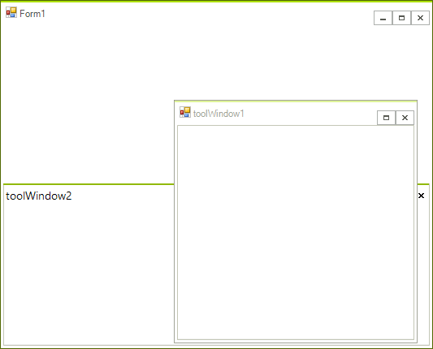

# Tracking the ActiveWindow

In certain scenarios you may need to track the moment the __ActiveWindow__ of __RadDock__ is being changed. For this purpose **RadDock** exposes two events:
      

* __ActiveWindowChanging:__ This event is fired when the active window is about to be changed, but it is still not changed. This allows you to cancel the active window changing operation. Depending on the scenario, you may need to understand which the currently active window is and which is the window that is about to become active. For this purpose, the event arguments of `ActiveWindowChanging` expose two useful properties:
        
    - __NewWindow__: returns the dock window that is about to become active.
                
    - __OldWindow__: returns the currently active window.
    
     In the picture below the currently active window is `toolWindow2`. Activating `toolWindow1` will cause `ActiveWindowChanging` to fire, and we can expect __NewWindow__ to return `toolWindow1` and __OldWindow__ to return `toolWindow2`.
     

* __AcitveWindowChanged:__ is fired after the active window is changed. Its arguments provide one property:
        
    * __DockWindow__: returns the activated window.
            

Considering the same scenario, where the currently active window is `toolWindow2`, activating the `toolWindow1` will first fire **ActiveWindowChanging** and if it is not canceled, **ActiveWindowChanged** will be fired. There, the __DockWindow__ property from the event arguments will return `toolWindow1`. In this case, you may also use __RadDock.ActiveWindow__ that will also return `toolWindow1`.
        
# See Also

* [AllowedDockStates]()
* [Creating a RadDock at Runtime]()
* [ Creating ToolWindow and DocumentWindow at Runtime]()
* [Customizing Floating Windows]()
* [Customizing TabStrip Items]()
* [Building an Advanced Layout at Runtime]()
* [RadDock Properties and Methods]()
* [Removing ToolWindow and DocumentWindow at Runtime]()
* [Tabs and Captions]()
* [ToolWindow and DocumentWindow Properties and Methods]()
* [Accessing DockWindows]()
