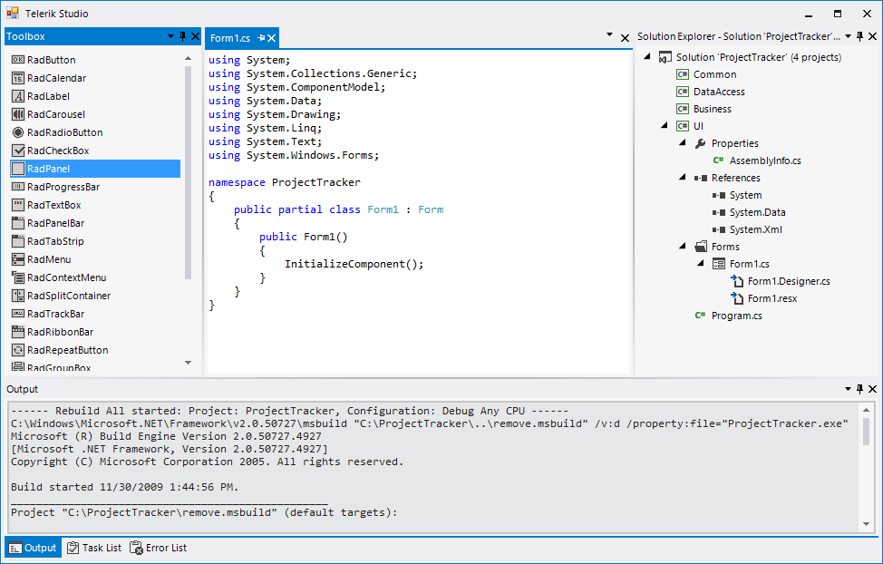
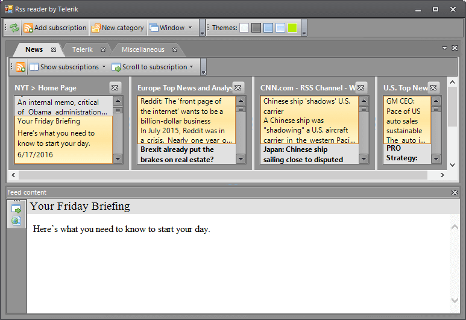
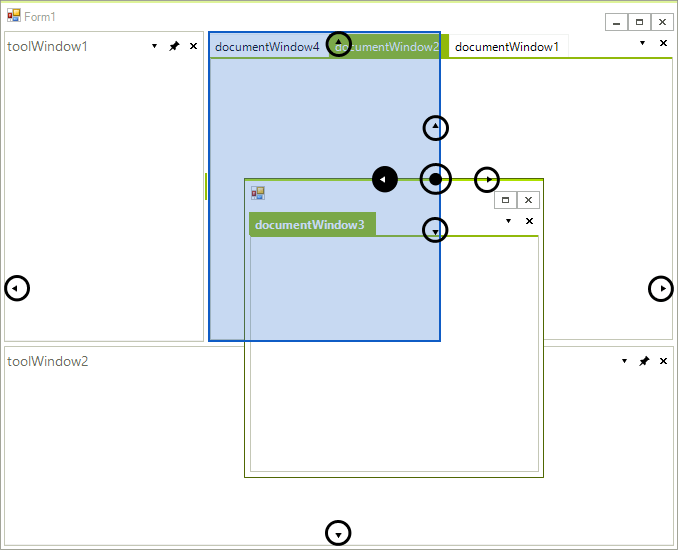
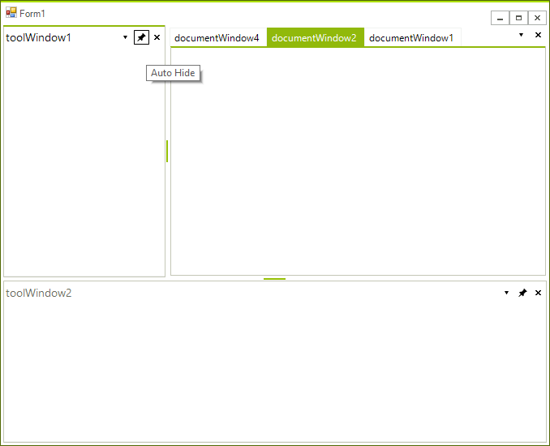
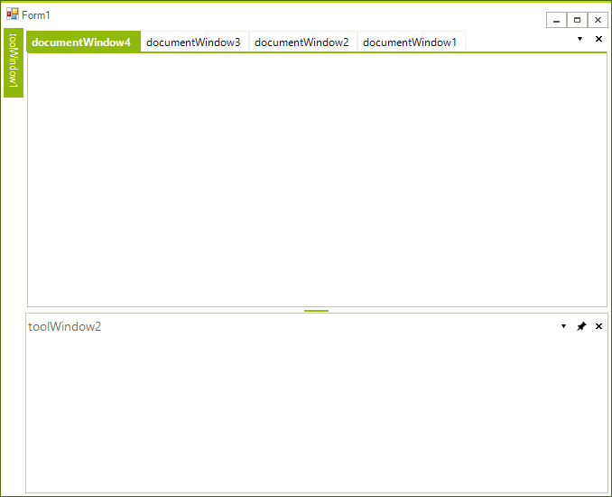
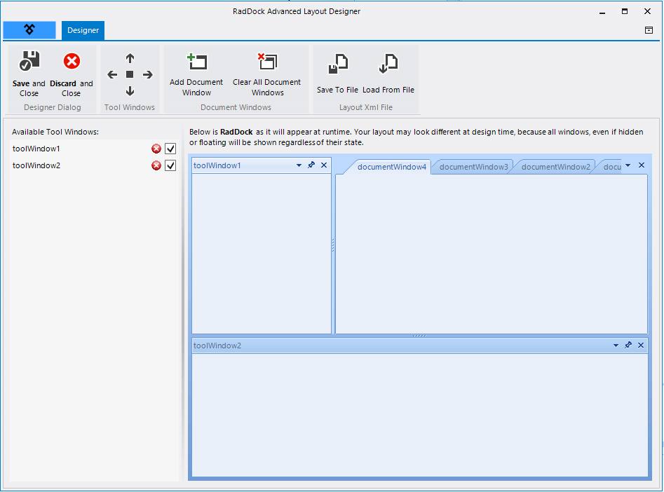
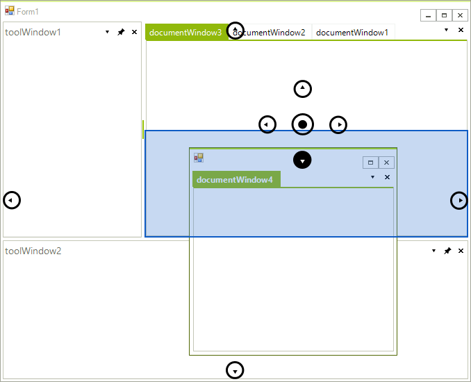

# WinForms Dock Overview

__RadDock__ helps you manage multiple windows in your application with a docking system similar to Microsoft Visual Studio. __RadDock__ can contain both tool and tabbed document style windows. It includes fully interactive design-time layout management as well.





>caption Figure 1: RadDock 

## Features

* The __RadDock__ control provides a container that holds dockable windows. This container can fill the entire client area of a Form, or can be limited to any rectangular area you choose to manage.

* Tool windows can be dragged outside their containers ("floating"), dragged to other containers, collapsed against the side of the **RadDock** and transformed to tabbed documents. Tool windows are supported by the **ToolWindow** control. You can place other controls within a **ToolWindow**.

* Tabbed documents can be switched between, floated, resized, dragged, to arrange in various configurations and closed. Tabbed documents are supported by the DocumentWindow control. You can place other controls within a DocumentWnidow.
            
* The *Advanced Layout Designer* gives you fully interactive design-time control over the number, position, and properties of **DockWindows** within a __RadDock__.

* __RadDock__ collects and uses the information about the state of each **DockWindow** - **FloatingSize**, **FloatingLocation**, **AutoHideSize**, **PreviousPosition**, **AutoHidePostion**, etc. dynamically.

* The __CloseAction__ property allows control over the window’s Close behavior.

* Different sizing modes (*Auto*, *Relative*, *Absolute*, *Fill*) virtually any layout scenario can be easily achieved. The user has complete control over sizing and layout behavior.

* **RadSplitContainer** composes a **SplitContainerLayoutStrategy**, which handles any layout request for this container. If the available size modes are not enough to fit into a layout scenario, then the entire layout strategy may be easily replaced/extended with a custom one.

* __RadDock__ stores all sizing information per panel in a separate object, it allows easy transition from one state to another and vice-versa without loosing the sizing information for each state.            

* **Load Layout** allows restoring previous scene at 100% - a layout persistence operation should now only serialize/deserialize the sizing info of each panel in order to completely store/restore its position on a split container.

* Re-dock support (transition to previous docked or floating state of Dock Windows) has been completely revisited for the new **RadDock** implementation. A service-based semantic is introduced, which saves a window’s state just before any dock operation is about to occur, and this state can easily be restored later on, upon user request (such as double-clicking a window’s caption area). This allows for exact transition to previous state - floating to docked and vice-versa. Even more, if an application requires completely custom re-dock semantic, it may be easily replaced by registering a custom service, which handles internal Save/Restore requests, made by the framework.
            
This sample RSS Reader implements __RadDock__ and several other Telerik UI for WinForms controls. Docked tool windows contain "*Feed Subscriptions*" and "*Feed Items*". A floating tool window contains the "*Behavior*" options. At bottom left, the "*Output*" tool window is shown collapsed against the bottom edge. The lower right side of the application displays tabbed documents containing articles.

## Tool Windows and Tabbed Documents

* Tool windows (DockPanels) can be floating, docked, pinned, unpinned and tabbed.  

* Horizontal or vertical splits between groups of DockPanels.

* Full drag and drop support including the docking compass and docking hints for visual feedback
    

* Tool windows can be "AutoHidden" (collapsed) or pinned open.  

    
    

* Fully interactive design-time layout management.

    

* Ctrl+Tab support for navigating between DockWindows.
 
     

* Tabbed documents (DocumentWindows) can be dragged and rearranged within the tabbed document container.

    

* Automatic MDI Support. As MDI children are added to a parent form the MDI children are added to the **RadDock** as tabbed documents.

* Support for custom tool window and custom tabbed documents. These objects are like standard **UserControl** and **Form** objects in the designer but add docking support for free. 

* Support for saving and loading panel layout.

| RELATED VIDEOS |  |
| ------ | ------ |
|The new and improved __RadDock__ for WinForms has landed and this is your opportunity to get a first look. Join Developer Evangelist John Kellar as he shows you how quickly you can get up and running with the new version of RadDock. John will cover the new features so you know what to expect and how you can use RadDock in your applications once it is officially released. (Runtime: 32:54) [Introducing the new RadDock for WinForms ](http://www.telerik.com/videos/winforms/introducing-the-new-raddock-for-winforms)|In this video, you will learn how to get started with the run-time and design-time features in the new RadDock for WinForms. You will see the rich RadDock run-time features in action and you will see how easy it is to get started with RadDock in Visual Studio. You will also be introduced to the new Advanced Layout Designer for RadDock, a design-time tool that makes it easy to customize your RadDock layouts. (Runtime: 09:42) [Getting Started with RadDock for WinForms ](http://www.telerik.com/videos/winforms/getting-started-with-raddock-for-winforms)|

## Telerik UI for WinForms Learning Resources
* [Telerik UI for WinForms Dock Homepage](https://www.telerik.com/products/winforms/dock.aspx)
* [Get Started with the Telerik UI for WinForms Dock]()
* [Telerik UI for WinForms API Reference](https://docs.telerik.com/devtools/winforms/api/)
* [Getting Started with Telerik UI for WinForms Components]()
* [Telerik UI for WinForms Virtual Classroom (Training Courses for Registered Users)](https://learn.telerik.com/learn/course/external/view/elearning/17/TelerikUIforWinForms) 
* [Telerik UI for WinForms Forum](https://www.telerik.com/forums/winforms)
* [Telerik UI for WinForms Knowledge Base](https://docs.telerik.com/devtools/winforms/knowledge-base)

## Telerik UI for WinForms Additional Resources
* [Telerik UI for WinForms Product Overview](https://www.telerik.com/products/winforms.aspx)
* [Telerik UI for WinForms Blog](https://www.telerik.com/blogs/desktop-winforms)
* [Telerik UI for WinForms Videos](https://www.telerik.com/videos/product/winforms)
* [Telerik UI for WinForms Roadmap](https://www.telerik.com/support/whats-new/winforms/roadmap)
* [Telerik UI for WinForms Pricing](https://www.telerik.com/purchase/individual/winforms.aspx)
* [Telerik UI for WinForms Code Library](https://www.telerik.com/support/code-library/winforms)
* [Telerik UI for WinForms Support](https://www.telerik.com/support/winforms)
* [What’s New in Telerik UI for WinForms](https://www.telerik.com/support/whats-new/winforms)

# See Also

* [Getting Started]()
* [Structure]()     
* [Advanced Layout Designer]()     
