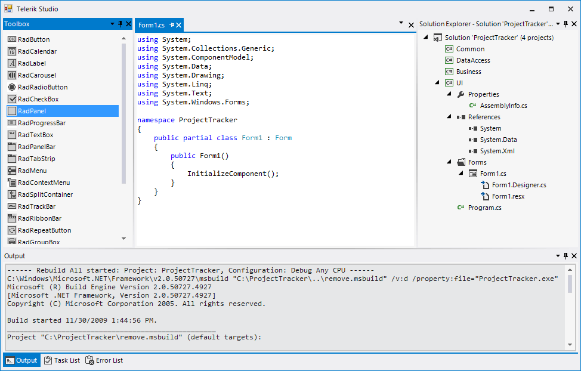
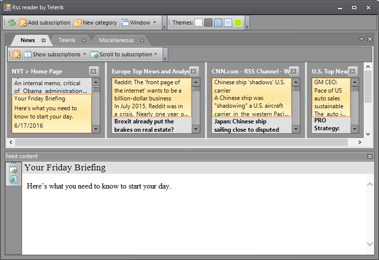
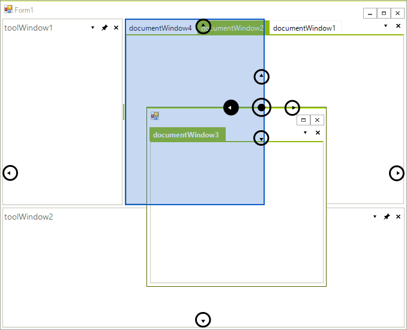
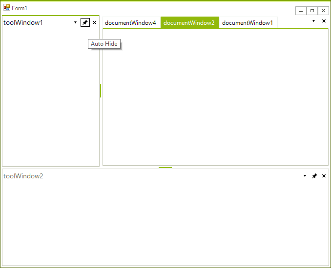
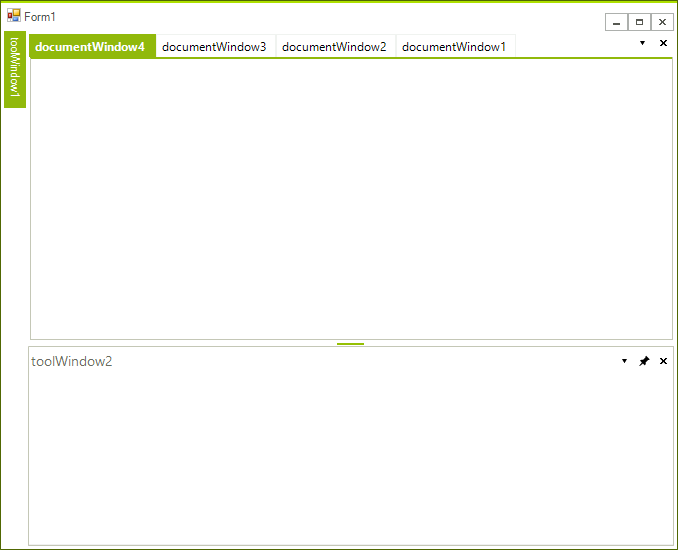
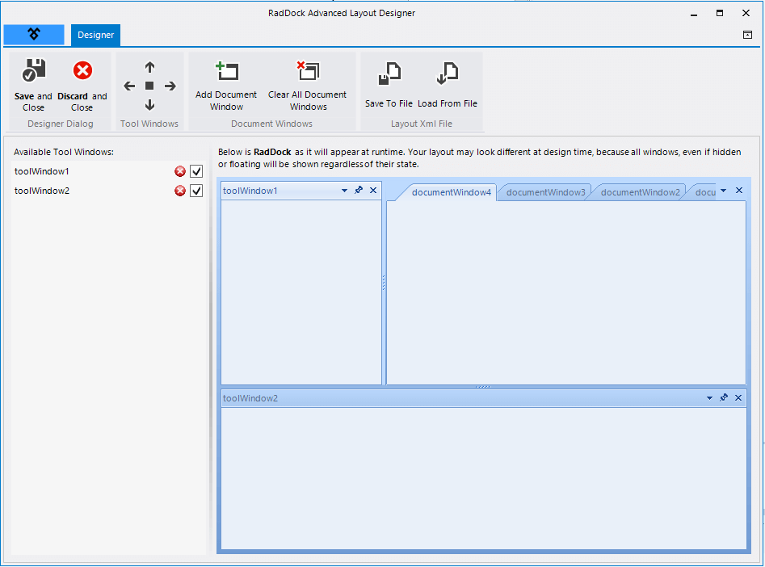
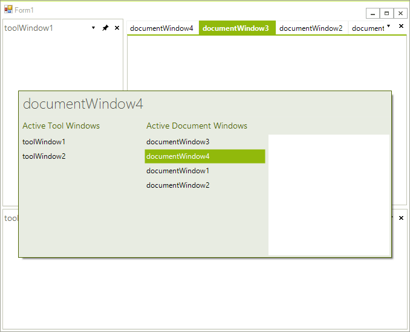
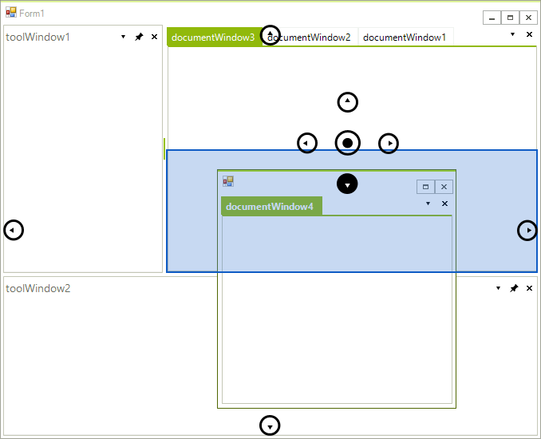
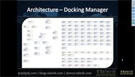
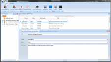

# WinForms RadDock Overview

`RadDock` lets you build Visual Studio-style workspaces in a WinForms application. Use it to host dockable tool windows, tabbed documents, floating panes, and persisted layouts in a single container.

This overview explains the main `RadDock` capabilities, shows the common window arrangements it supports, and points you to the next articles for implementation details.





## What RadDock Helps You Build

`RadDock` can fill the entire client area of a form or manage only a specific rectangular region. This makes it a good fit for applications that need document editing surfaces, resizable tool panes, or customizable workspaces.

**RadDock hosting dockable windows inside a WinForms application.**

## Key Features

Use `RadDock` when your application needs the following capabilities:

* Host dockable windows in a single container that can span all or part of a form.
* Arrange `ToolWindow` and `DocumentWindow` instances in docked, floating, tabbed, or auto-hidden states.
* Resize panes with the `Auto`, `Relative`, `Absolute`, and `Fill` sizing modes.
* Persist layout information, including panel size, position, and docking state, and restore it later.
* Control window-closing behavior through the `CloseAction` property.
* Extend layout behavior through `RadSplitContainer` and `SplitContainerLayoutStrategy` when the default layout logic does not meet your scenario.
* Restore a previous docked or floating state through the built-in re-dock behavior.
* Configure layouts interactively at design time with the Advanced Layout Designer.

The following sample shows a typical `RadDock` workspace. Tool windows host feed lists and behavior settings, while document windows display tabbed article content.

**Sample application that uses tool windows, floating panes, auto-hidden output, and tabbed documents.**

## Tool Windows and Document Windows

`RadDock` supports two main window types. Use `ToolWindow` for supporting UI such as explorers, properties, filters, and output panes. Use `DocumentWindow` for the main content area when users need to switch between tabbed documents.

Common docking interactions include the following:

* Float, dock, pin, unpin, or tab tool windows.
* Split groups of dock windows horizontally or vertically.
* Drag documents to rearrange the tab order or move them to another group.
* Add MDI child forms automatically as tabbed documents.
* Create custom tool windows or custom document windows when you need docking support around your own controls.

### Dock, Float, and Auto-Hide Panes

During drag and drop, `RadDock` shows a docking compass and visual hints so users can place a window precisely.

**Docking compass and visual hints shown while dragging a pane.**

Tool windows can also switch to an auto-hidden state to preserve screen space while keeping the pane available.

**Auto-hidden tool window collapsed to the edge of the dock area.**

**Pinned tool window expanded from its collapsed state.**

### Design and Navigate the Layout

Use the Advanced Layout Designer to configure the number, position, and properties of dock windows visually at design time.

**Advanced Layout Designer used to configure a RadDock workspace.**

At run time, users can move quickly between windows with keyboard navigation such as `Ctrl+Tab`.

**Window navigation interface displayed when cycling through docked panes.**

### Rearrange Tabbed Documents

`DocumentWindow` tabs can be dragged, reordered, resized, floated, and grouped into different document arrangements.

**Tabbed documents rearranged within the document area.**

## Save, Restore, and Customize Layouts

`RadDock` tracks window state information for each `DockWindow`, such as floating size, floating location, auto-hide size, and previous docking position. Because layout information is stored separately from the panel content, users can switch between states without losing the sizing details for each state.

Use layout persistence when your application needs to restore the user workspace between sessions. This is especially useful for line-of-business applications, editors, and dashboards where users customize pane placement.

If you need more control than the default behavior provides, extend the layout process through `RadSplitContainer` and `SplitContainerLayoutStrategy`, or replace the re-dock service with your own implementation.

## Watch the Video Tutorials

Use these videos for a guided overview of the control:

* [Introducing the new RadDock for WinForms](http://www.telerik.com/videos/winforms/introducing-the-new-raddock-for-winforms) explains the main features and shows how to start working with the updated control.
* [Getting Started with RadDock for WinForms](http://www.telerik.com/videos/winforms/getting-started-with-raddock-for-winforms) demonstrates the run-time and design-time workflow, including the Advanced Layout Designer. 

**Video overview of the new RadDock experience for WinForms.**

**Getting-started video for RadDock design-time and run-time features.**

## Telerik UI for WinForms Learning Resources

Continue with these product-specific resources:

* [Telerik UI for WinForms Dock homepage](https://www.telerik.com/products/winforms/dock.aspx)
* [Get started with the Telerik UI for WinForms Dock]()
* [Telerik UI for WinForms API reference](https://docs.telerik.com/devtools/winforms/api/)
* [Getting started with Telerik UI for WinForms components]()
* [Telerik UI for WinForms virtual classroom training courses for registered users](https://learn.telerik.com/learn/course/external/view/elearning/17/TelerikUIforWinForms)
* [Telerik UI for WinForms forum](https://www.telerik.com/forums/winforms)
* [Telerik UI for WinForms knowledge base](https://docs.telerik.com/devtools/winforms/knowledge-base)

## Telerik UI for WinForms Additional Resources

Use these broader resources to evaluate, plan, and support a WinForms project:

* [Telerik UI for WinForms product overview](https://www.telerik.com/products/winforms.aspx)
* [Telerik UI for WinForms blog](https://www.telerik.com/blogs/desktop-winforms)
* [Telerik UI for WinForms videos](https://www.telerik.com/videos/product/winforms)
* [Telerik UI for WinForms roadmap](https://www.telerik.com/support/whats-new/winforms/roadmap)
* [Telerik UI for WinForms pricing](https://www.telerik.com/purchase/individual/winforms.aspx)
* [Telerik UI for WinForms code library](https://www.telerik.com/support/code-library/winforms)
* [Telerik UI for WinForms support](https://www.telerik.com/support/winforms)
* [What’s new in Telerik UI for WinForms](https://www.telerik.com/support/whats-new/winforms)

## See Also

* [Get started with RadDock]()
* [Understand the RadDock structure]()
* [Use the Advanced Layout Designer]()
