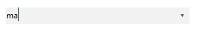
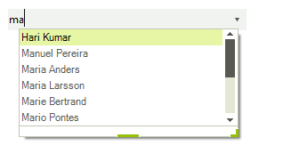
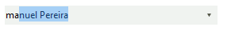
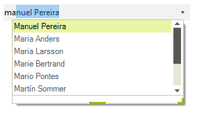

# AutoCompleteModes
 
The __AutoCompleteMode__ property controls auto-complete behavior and can be set to *None*, *Suggest*, *Append* and *SuggestAppend*.   


You can set the __AutoCompleteMode__ as follows:

#### Set AutoCompleteMode 
 
{{source=..\SamplesCS\DropDownListControl\CheckedDropDownList\AutoCompleteModes1.cs region=SetMode}} 
{{source=..\SamplesVB\DropDownListControl\CheckedDropDownList\AutoCompleteModes1.vb region=SetMode}} 

````C#
this.radCheckedDropDownList1.AutoCompleteMode = AutoCompleteMode.SuggestAppend;

````
````VB.NET
Me.RadCheckedDropDownList1.AutoCompleteMode = AutoCompleteMode.SuggestAppend

````

{{endregion}} 

 
* *None*: Nothing happens when a user begins to type into the text box portion of the control.  

>caption Figure 1: AutoCompleteMode.None

 

* *Suggest*: As the user types an entry into the text box, the drop-down portion of the control is shown, and the items that contains the entered text are displayed.

>caption Figure 2: AutoCompleteMode.Suggest

 

* *Append*: As the user types, the next item in the list that matches the user input is automatically appended to the characters the user has already typed. The drop-down list is not shown without the user clicking the arrow.

>caption Figure 3: AutoCompleteMode.Append

 

* *SuggestAppend*: Similar to the Append setting, but the drop-down list is shown and the suggested item is highlighted.

>caption Figure 4: AutoCompleteMode.SuggestAppend




