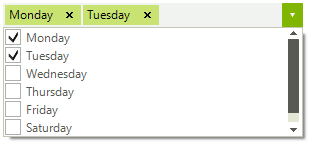

# CheckedDropDownList

__RadCheckedDropDownList__ combines [RadDropDownList]() and [RadAutoCompleteBox]() in order to provide functionality to check items in the drop down area and tokenize them in the text area. All previous functionality is preserved, such as visual formatting and data binding, which is now extended. 

# See Also

* [Getting Started]()
* [Design Time]()