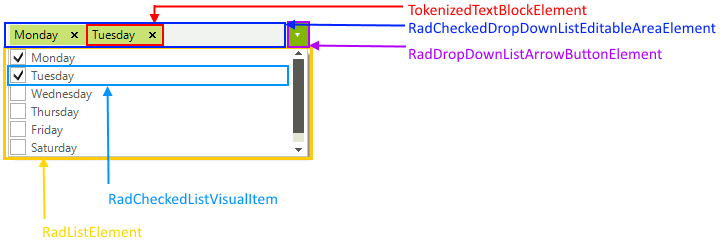

# Structure
 
This article describes the inner structure and organization of the elements which build __RadCheckedDropDownList__  control.
        
>caption Figure 1: RadCheckedDropDownList's elements hierarchy

>caption Figure 2: RadCheckedDropDownList's structure

1. __RadCheckedDropDownListElement__: The main element of the control which holds all other elements. It can be accessed by the RadCheckedDropDownList.__CheckedDropDownListElement__ property. It also gives you access to the popup which shows when the arrow button is clicked: RadCheckedDropDownList.CheckedDropDownListElement.__PopupForm__.  
  1.1. __RadCheckedDropDownListEditableAreaElement__: Contains the [editor]() and the arrow button.  
&nbsp;&nbsp;&nbsp;&nbsp;&nbsp;1.1.1. __CheckedDropDownAutoCompleteBoxElement__: An instance of the [RadAutoCompleteBox]()   
&nbsp;&nbsp;&nbsp;&nbsp;&nbsp;&nbsp;1.1.1.1. __AutoCompleteBoxViewElement__  
  1.2. __RadDropDownListArrowButtonElement__: Expands the RadListElement.
 

# See Also

* [RadControlSpy]()
* [Getting Started]()
