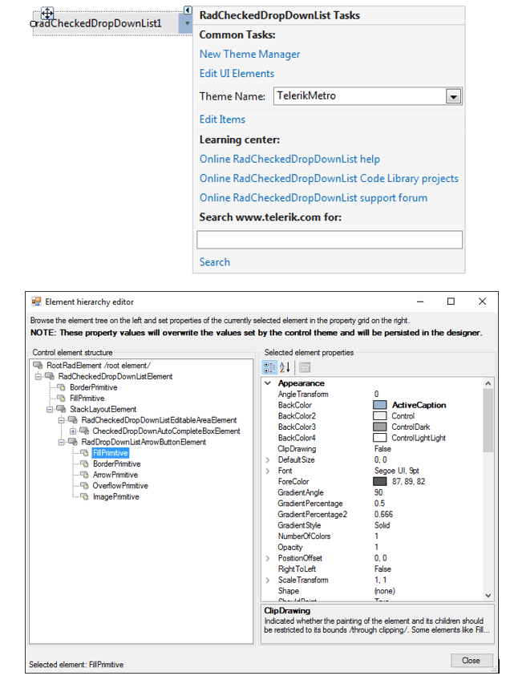
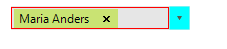

# Accessing and Customizing Elements
 
Accessing and customizing elements can be performed either at design time, or at run time. Before proceeding with this topic, it is recommended to get familiar with the [visual structure]() of the __RadCheckedDropDownList__.
      

## Design time

You can access and modify the style for different elements in __RadCheckedDropDownList__ by using the *Element hierarchy editor*.

>note In order to access the *Element hierarchy editor* select RadCheckedDropDownList and click the small arrow on the top right position in order to open the Smart Tag. Then, click the *Edit UI Elements*.

>caption Figure 1: Element hierarchy editor



## Programmatically

You can customize the nested elements at run time as well:

>caption Figure 2: Customize elements



#### Customize elements 

{{source=..\SamplesCS\DropDownListControl\CheckedDropDownList\Customization1.cs region=CustomizeElements}} 
{{source=..\SamplesVB\DropDownListControl\CheckedDropDownList\Customization1.vb region=CustomizeElements}} 

````C#
            
this.radCheckedDropDownList1.DropDownListElement.ArrowButton.Fill.BackColor = Color.Aqua;
this.radCheckedDropDownList1.DropDownListElement.EditableElement.BorderColor  = Color.Red;
this.radCheckedDropDownList1.DropDownListElement.EditableElement.DrawBorder = true;
this.radCheckedDropDownList1.DropDownListElement.EditableElement.BorderGradientStyle = GradientStyles.Solid;
this.radCheckedDropDownList1.DropDownListElement.EditableElement.BorderWidth = 1;

````
````VB.NET
Me.RadCheckedDropDownList1.DropDownListElement.ArrowButton.Fill.BackColor = Color.Aqua
Me.RadCheckedDropDownList1.DropDownListElement.EditableElement.BorderColor = Color.Red
Me.RadCheckedDropDownList1.DropDownListElement.EditableElement.DrawBorder = True
Me.RadCheckedDropDownList1.DropDownListElement.EditableElement.BorderGradientStyle = GradientStyles.Solid
Me.RadCheckedDropDownList1.DropDownListElement.EditableElement.BorderWidth = 1

````

{{endregion}} 
 
In order to style the pop-up items it is suitable to use the [Formatting Items]() event.
