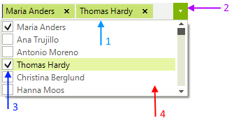
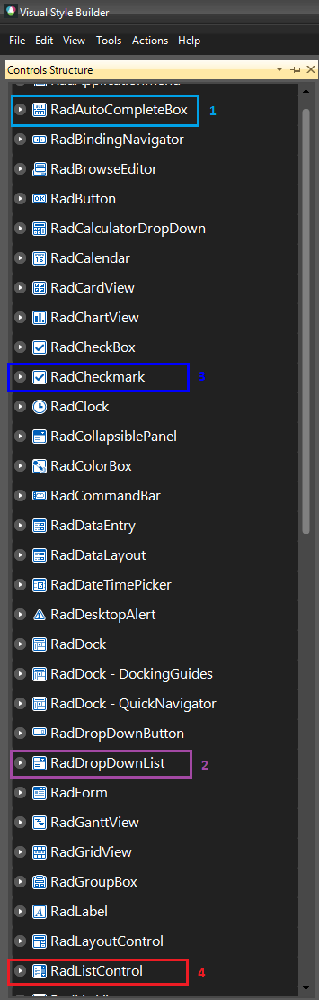

# Themes

__RadCheckedDropDownList__, as other RadControls, reuses some components and respectively their theming. It consists of 4 different controls:
        

1. __RadAutoCompleteBox__ - Provides theming for the text area and the tokens
            

1. __RadDropDownList__ - Provides theming for the arrow button and the size of the control
            

1. __RadCheckMark__ - Provides theming for the checkboxes of the items
            

1. __RadListControl__ - Provides theming for the items in the dropdown
            

You can see where to find each control in Visual Style Builder on the image below. We recommend to you to get to know [Visual Style Builder]() before doing any serious theming work.
        
>caution If you want to use separate themes for __RadCheckedDropDownList__ and __RadAutoCompleteBox__ for example, you need to create two different themes. Use the *ThemeResolutionService.ApplyThemeToControlTree* method to apply a theme to a single control.

# See Also 

* [Getting Started with VisualStyleBuilder]()
* [Working With Repository Items]()
* [Themes | RadDropDownList]()
* [Themes | RadAutoCompleteBox]()
* [Themes | RadListControl]()
