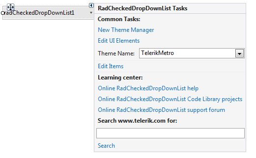

# Design Time

To start using __RadCheckedDropDownList__ just drag it from the toolbox and drop it at the form.

## Smart Tag

Select __RadCheckedDropDownList__ and click the small arrow on the top right position in order to open the __Smart Tag__. The __Smart Tag__ for __RadCheckedDropDownList__ lets you quickly access common tasks involved with building __RadCheckedDropDownList__ elements and customizing appearance through themes.

>caption Figure 1: Smart Tag

* __New Theme Manager__: Adds a new __RadThemeManager__ component to the form.
            

* __Edit UI Elements__: Allows setting properties at multiple levels of the class hierarchy.
            
>caption Figure 2: Element hierarchy editor

* __Theme Name__: Select a theme name from the drop down list of themes available for that control. Selecting a theme allows you to change all aspects of the control's visual style at one time.
            

* __Edit Items__: Allows populating the __RadDropDownList__ at design time.

* __Learning Center__: Navigate to the Telerik help, code library projects or support forum.

* __Search__: Search the Telerik site for a given string.            

# See Also

* [Getting Started]()
