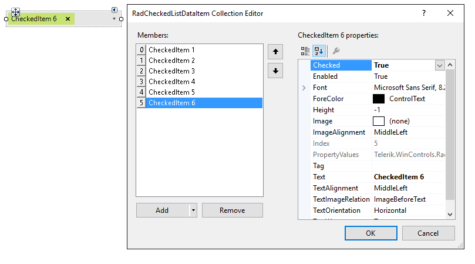
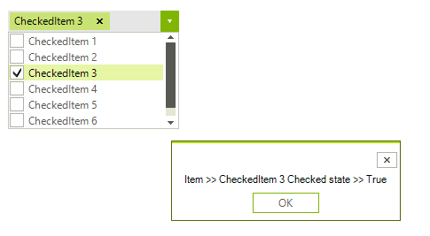

# Getting Started with WinForms CheckedDropDownList
 
The following tutorial demonstrates how to populate __RadCheckedDropDownList__ and how to react to a user's choice in code.

>caption Figure 1: Adding items at design time



1\. Drag __RadCheckedDropDownList__ to a form and click the *Smart Tag*.
            

2\. Click the *Edit Items* button.
            

3\. Add a few items.
            

4\. Check some of them.

5\. In the *Properties* section in Visual Studio select the events button and double click the __ItemCheckedChanged__ event.

6\. Replace the automatically generated event handler with this code:

#### Handling ItemCheckedChanged event

{{source=..\SamplesCS\DropDownListControl\CheckedDropDownList\GettingStarted1.cs region=AddItems}} 
{{source=..\SamplesVB\DropDownListControl\CheckedDropDownList\GettingStarted1.vb region=AddItems}} 

````C#
private void radCheckedDropDownList1_ItemCheckedChanged(object sender, RadCheckedListDataItemEventArgs e)
{
      RadMessageBox.Show(" Item >> " + e.Item.Text + " Checked state >> " + e.Item.Checked);
}

````
````VB.NET
Private Sub radCheckedDropDownList1_ItemCheckedChanged(sender As Object, e As RadCheckedListDataItemEventArgs)
    RadMessageBox.Show(" Item >> " + e.Item.Text + " Checked state >> " + e.Item.Checked)
End Sub

````

>caption Figure 2: Handling ItemCheckedChanged



# See Also

* [Structure]()
* [Design Time]()
* [How to Order the Tokens Based on the Items Collection]()

## Telerik UI for WinForms Learning Resources
* [Telerik UI for WinForms CheckedDropDownList Component](https://www.telerik.com/products/winforms/checkeddropdownlist.aspx)
* [Getting Started with Telerik UI for WinForms Components](https://docs.telerik.com/devtools/winforms/getting-started/first-steps)
* [Telerik UI for WinForms Setup](https://docs.telerik.com/devtools/winforms/installation-and-upgrades/installing-on-your-computer)
* [Telerik UI for WinForms Application Modernization](https://docs.telerik.com/devtools/winforms/winforms-converter/overview)
* [Telerik UI for WinForms Visual Studio Templates](https://docs.telerik.com/devtools/winforms/visual-studio-integration/visual-studio-templates)
* [Deploy Telerik UI for WinForms Applications](https://docs.telerik.com/devtools/winforms/deployment-and-distribution/application-deployment)
* [Telerik UI for WinForms Virtual Classroom(Training Courses for Registered Users)](https://learn.telerik.com/learn/course/external/view/elearning/17/telerik-ui-for-winforms)
* [Telerik UI for WinForms License Agreement)](https://www.telerik.com/purchase/license-agreement/winforms-dlw-s)

