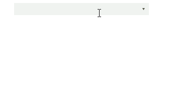

# Add non-existing Items
 
There are cases where the item which the user is typing is not in the current list of items. In this case, you can manually add it.

For this purpose, __RadCheckedDropDownList__ has the __TokenValidating__ event. It gives you information for the token's text and whether the token, being validated, is valid. You can use this to check whether the item is already present in the items of the __RadCheckedDropDownList__ and make the token valid:

#### Subscribe for TokenValidating 

<snippet id='checkeddropdownlist-add-non-existing-items-subscribe-cs' />
<snippet id='checkeddropdownlist-add-non-existing-items-subscribe-vb' />

#### Add non-existing items 

<snippet id='checkeddropdownlist-add-non-existing-items-handler-cs' />
<snippet id='checkeddropdownlist-add-non-existing-items-handler-vb' />

>note In order to make the custom text a valid token, it is necessary to enter the delimeter which is __;__ by default.

>caption Figure 1: Tokens Validating

