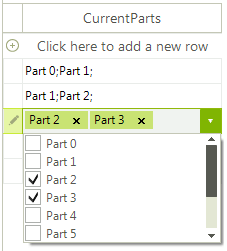

# Use as RadGridView editor
 
As many other RadControls, __RadCheckedDropDownList__ can also be used as [editor]() in [RadGridView](). This article will show you how to achieve the following result.

>caption Figure 1: RadCheckedDropDownList as an editor in RadGridView 



1\. Add a __RadGridView__ to a Form and add a regular text box column which will use the new editor. You can bind the grid to a list of sample data and create the data source for __RadCheckedDropDownList__:
        
>note The "MyPart" class contains a singe public property named "CurrentParts" and a constructor that sets this property.
>

#### Initialize 

{{source=..\SamplesCS\DropDownListControl\CheckedDropDownList\How-To\UseAsRadGridViewEditor1.cs region=InitGrid}} 
{{source=..\SamplesVB\DropDownListControl\CheckedDropDownList\How-To\UseAsRadGridViewEditor1.vb region=InitGrid}} 

````C#
        
BindingList<MyPart> columnData;
BindingList<MyPart> datasource;
public UseAsRadGridViewEditor1()
{
    InitializeComponent();
    
    columnData = new BindingList<MyPart>();
    datasource = new BindingList<MyPart>();
    
    for (int i = 0; i < 5; i++)
    {
        datasource.Add(new MyPart("Part " + i + ";Part " + (i + 1) + ";"));
    }
    radGridView1.AutoGenerateColumns = false;
    radGridView1.DataSource = datasource;
    
    GridViewTextBoxColumn checkedDropDownListColumn = new GridViewTextBoxColumn();
    checkedDropDownListColumn.FieldName = "CurrentParts";
    checkedDropDownListColumn.Width = 200;
    
    this.radGridView1.Columns.Add(checkedDropDownListColumn);
    
    for (int i = 0; i < 10; i++)
    {
        columnData.Add(new MyPart("Part " + i));
    }
    
    this.radGridView1.EditorRequired += radGridView1_EditorRequired;
}

````
````VB.NET
Private columnData As BindingList(Of MyPart)
Private datasource As BindingList(Of MyPart)
Public Sub New()
    InitializeComponent()
    columnData = New BindingList(Of MyPart)()
    datasource = New BindingList(Of MyPart)()
    For i As Integer = 0 To 4
        datasource.Add(New MyPart("Part " & i & ";Part " & (i + 1) & ";"))
    Next i
    radGridView1.AutoGenerateColumns = False
    radGridView1.DataSource = datasource
    Dim checkedDropDownListColumn As New GridViewTextBoxColumn()
    checkedDropDownListColumn.FieldName = "CurrentParts"
    checkedDropDownListColumn.Width = 200
    Me.RadGridView1.Columns.Add(checkedDropDownListColumn)
    For i As Integer = 0 To 9
        columnData.Add(New MyPart("Part " & i))
    Next i
    AddHandler Me.radGridView1.EditorRequired, AddressOf radGridView1_EditorRequired
End Sub

````

{{endregion}} 
 
2\. The next step is to replace the default editor. This can be achieved by handling the __EditorReqired__ event. This is the place where the data source should be set as well.  

#### Change the editor 

{{source=..\SamplesCS\DropDownListControl\CheckedDropDownList\How-To\UseAsRadGridViewEditor1.cs region=Required}} 
{{source=..\SamplesVB\DropDownListControl\CheckedDropDownList\How-To\UseAsRadGridViewEditor1.vb region=Required}} 

````C#
    
void radGridView1_EditorRequired(object sender, EditorRequiredEventArgs e)
{
    if (this.radGridView1.CurrentColumn.Index == 0)
    {
        RadCheckedDropDownListElement editor = new GridViewCheckedDropDownListEditor();
        editor.DataSource = this.columnData;
        editor.DisplayMember = "CurrentParts";
        e.Editor = editor;
    }
}

````
````VB.NET
Private Sub radGridView1_EditorRequired(ByVal sender As Object, ByVal e As EditorRequiredEventArgs)
    If Me.radGridView1.CurrentColumn.Index = 0 Then
        Dim editor As RadCheckedDropDownListElement = New GridViewCheckedDropDownListEditor()
        editor.DataSource = Me.columnData
        editor.DisplayMember = "CurrentParts"
        e.Editor = editor
    End If
End Sub

````

{{endregion}} 
 
3\. The final step is creating the editor. This can be achieved by creating a descendant of __RadCheckedDropDownListElement__ and overriding its __Value__ property.

#### Editor 

{{source=..\SamplesCS\DropDownListControl\CheckedDropDownList\How-To\UseAsRadGridViewEditor1.cs region=Editor}} 
{{source=..\SamplesVB\DropDownListControl\CheckedDropDownList\How-To\UseAsRadGridViewEditor1.vb region=Editor}} 

````C#
        
public class GridViewCheckedDropDownListEditor : RadCheckedDropDownListElement
{
    public override object Value
    {
        get
        {
            return this.Text;
        }
        set
        {
            this.Text = value.ToString();
        }
    }
}

````
````VB.NET
Public Class GridViewCheckedDropDownListEditor
    Inherits RadCheckedDropDownListElement
    Public Overrides Property Value() As Object
        Get
            Return Me.Text
        End Get
        Set(ByVal value As Object)
            Me.Text = value.ToString()
        End Set
    End Property
End Class

````

{{endregion}} 


