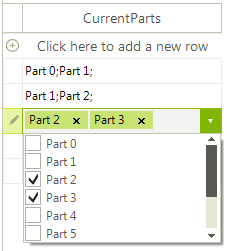

# Use as RadGridView editor
 
As many other RadControls, __RadCheckedDropDownList__ can also be used as [editor]() in [RadGridView](). This article will show you how to achieve the following result.

>caption Figure 1: RadCheckedDropDownList as an editor in RadGridView 

1\. Add a __RadGridView__ to a Form and add a regular text box column which will use the new editor. You can bind the grid to a list of sample data and create the data source for __RadCheckedDropDownList__:
        
>note The "MyPart" class contains a singe public property named "CurrentParts" and a constructor that sets this property.
>

#### Initialize 

<snippet id='checkeddropdownlist-use-as-radgridview-editor-initgrid-cs' />
<snippet id='checkeddropdownlist-use-as-radgridview-editor-initgrid-vb' />

 
2\. The next step is to replace the default editor. This can be achieved by handling the __EditorReqired__ event. This is the place where the data source should be set as well.  

#### Change the editor 

<snippet id='checkeddropdownlist-use-as-radgridview-editor-required-cs' />
<snippet id='checkeddropdownlist-use-as-radgridview-editor-required-vb' />

 
3\. The final step is creating the editor. This can be achieved by creating a descendant of __RadCheckedDropDownListElement__ and overriding its __Value__ property.

#### Editor 

<snippet id='checkeddropdownlist-use-as-radgridview-editor-editor-cs' />
<snippet id='checkeddropdownlist-use-as-radgridview-editor-editor-vb' />

