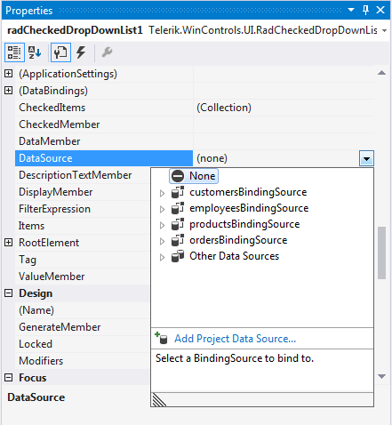
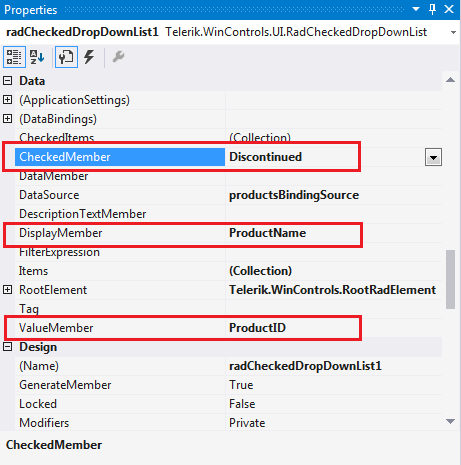
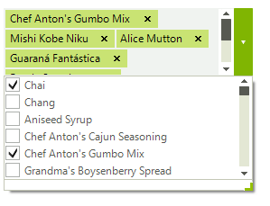
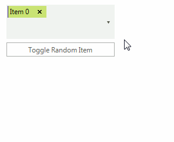

# Data binding
 
Data binding is a mechanism for automatic population of the __RadCheckedDropDownList__ with items, based on the provided data structure. Four properties control the data binding:

* __DataSource__ - specifies the data structure to be bound.
          

* __DisplayMember__ - specifies the particular field in the data source which will be used from the items in __RadCheckedDropDownList__ for their Text.
          

* __ValueMember__ - specifies the particular field in the data source which will be stored in the items Value property.

* __CheckedMember__ - specifies the particular field in the data source which will be stored in the items Checked property.
          
__RadCheckedDropDownList__ supports data binding either at design time or at run time:

## Data binding at design time

You can set the __DataSource__ property at design time in the *Properties* window of Visual Studio.

1. Select the __DataSource__ property and click the drop-down arrow to display all existing data sources on the form. 

1. Click the *Add Project Data Source…* link and follow the instructions in the *Data Source Configuration Wizard*  to add a data source to your project. You can use a single database table. 

	>caption Figure 1: Setting the DataSource at Design time

	

1. Afterwards, you need to specify the __CheckedMember__, __DisplayMember__ and __ValueMember__ properties.

	>caption Figure 2: Setting the CheckedMember, DisplayMember and ValueMember properties at Design time

	

	>caption Figure 3: RadCheckedDropDownList bound at Design time

	

## Data binding at run time

In the below example we will observe a case where we bind __RadCheckedDropDownList__ to a collection of items. __RadCheckedDropDownList__ has to be able to update its state properly when the relevant property in our model changes.
       

First, our model. It must implement the __INotifyPropertyChanged__ interface, so __RadCheckedDropDownList__ can get notifications.

#### Model 

{{source=..\SamplesCS\DropDownListControl\CheckedDropDownList\DataBinding1.cs region=Model}} 
{{source=..\SamplesVB\DropDownListControl\CheckedDropDownList\DataBinding1.vb region=Model}} 

````C#
class Model : INotifyPropertyChanged
{
    private int id;
    private bool selected;
    private string name;
    public int Id
    {
        get { return this.id; }
        set { this.id = value; this.OnPropertyChanged("Id"); }
    }
    public bool Selected
    {
        get { return this.selected; }
        set { this.selected = value; this.OnPropertyChanged("Selected"); }
    }
    public string Name
    {
        get { return this.name; }
        set { this.name = value; this.OnPropertyChanged("Name"); }
    }
    public event PropertyChangedEventHandler PropertyChanged;
    protected virtual void OnPropertyChanged(string propName)
    {
        if (this.PropertyChanged != null)
        {
            this.PropertyChanged(this, new PropertyChangedEventArgs(propName));
        }
    }
}

````
````VB.NET
Private Class Model
    Implements INotifyPropertyChanged
    Private m_id As Integer
    Private m_selected As Boolean
    Private m_name As String
    Public Property Id() As Integer
        Get
            Return Me.m_id
        End Get
        Set(value As Integer)
            Me.m_id = value
            Me.OnPropertyChanged("Id")
        End Set
    End Property
    Public Property Selected() As Boolean
        Get
            Return Me.m_selected
        End Get
        Set(value As Boolean)
            Me.m_selected = value
            Me.OnPropertyChanged("Selected")
        End Set
    End Property
    Public Property Name() As String
        Get
            Return Me.m_name
        End Get
        Set(value As String)
            Me.m_name = value
            Me.OnPropertyChanged("Name")
        End Set
    End Property
    Public Event PropertyChanged As PropertyChangedEventHandler Implements INotifyPropertyChanged.PropertyChanged
    Protected Overridable Sub OnPropertyChanged(propName As String)
        RaiseEvent PropertyChanged(Me, New PropertyChangedEventArgs(propName))
    End Sub
End Class

````

{{endregion}} 

 
Now drag a __RadCheckedDropDownList__ to the form and a __RadButton__. The button will be used to check a random item in our data source. In order to bind __RadCheckedDropDownList__ we must assign it a __BindingList__ filled with items and set its *Checked*, *Display* and *Value* members:

#### Model 

{{source=..\SamplesCS\DropDownListControl\CheckedDropDownList\DataBinding1.cs region=DataAndBinding}} 
{{source=..\SamplesVB\DropDownListControl\CheckedDropDownList\DataBinding1.vb region=DataAndBinding}} 

````C#
private BindingList<Model> dataSource = new BindingList<Model>();
private Random rnd = new Random();
public DataBinding1()
{
    InitializeComponent();
    this.radCheckedDropDownList1.CheckedMember = "Selected";
    this.radCheckedDropDownList1.DisplayMember = "Name";
    this.radCheckedDropDownList1.ValueMember = "Id";
    for (int i = 0; i < 15; i++)
    {
        dataSource.Add(new Model
        {
            Id = i,
            Name = "Item " + i
        });
    }
    this.radCheckedDropDownList1.DataSource = this.dataSource;
    this.radButton1.Text = "Toggle Random Item";
    this.radButton1.Click += radButton1_Click;
}
void radButton1_Click(object sender, EventArgs e)
{
    int index = rnd.Next(0, dataSource.Count);
    Model item = this.dataSource[index];
    item.Selected = !item.Selected;
}

````
````VB.NET
Private dataSource As New BindingList(Of Model)()
Private rnd As New Random()
Public Sub New()
    InitializeComponent()
    Me.RadCheckedDropDownList1.CheckedMember = "Selected"
    Me.RadCheckedDropDownList1.DisplayMember = "Name"
    Me.RadCheckedDropDownList1.ValueMember = "Id"
    For i As Integer = 0 To 14
        dataSource.Add(New Model() With { _
             .Id = i, _
             .Name = "Item " & i _
        })
    Next
    Me.RadCheckedDropDownList1.DataSource = Me.dataSource
    Me.radButton1.Text = "Toggle Random Item"
    AddHandler Me.radButton1.Click, AddressOf radButton1_Click
End Sub
Private Sub radButton1_Click(sender As Object, e As EventArgs)
    Dim index As Integer = rnd.[Next](0, dataSource.Count)
    Dim item As Model = Me.dataSource(index)
    item.Selected = Not item.Selected
End Sub

````

{{endregion}} 

>caption Figure 4: RadCheckedDropDownList bound at Run time



# See Also

* [Design Time]()
* [Adding Items Programmatically]()
