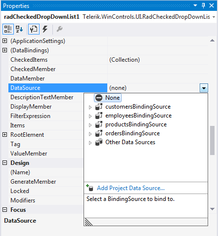
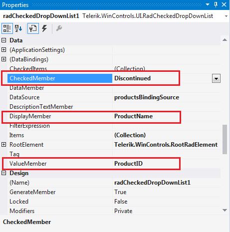
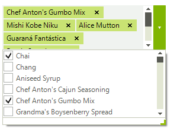
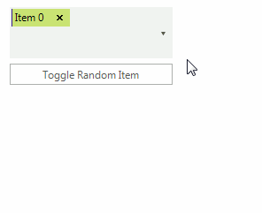

# Data binding
 
Data binding is a mechanism for automatic population of the __RadCheckedDropDownList__ with items, based on the provided data structure. Four properties control the data binding:

* __DataSource__ - specifies the data structure to be bound.
          

* __DisplayMember__ - specifies the particular field in the data source which will be used from the items in __RadCheckedDropDownList__ for their Text.
          

* __ValueMember__ - specifies the particular field in the data source which will be stored in the items Value property.

* __CheckedMember__ - specifies the particular field in the data source which will be stored in the items Checked property.
          
__RadCheckedDropDownList__ supports data binding either at design time or at run time:

## Data binding at design time

You can set the __DataSource__ property at design time in the *Properties* window of Visual Studio.

1. Select the __DataSource__ property and click the drop-down arrow to display all existing data sources on the form. 

1. Click the *Add Project Data Source…* link and follow the instructions in the *Data Source Configuration Wizard*  to add a data source to your project. You can use a single database table. 

	>caption Figure 1: Setting the DataSource at Design time

	

1. Afterwards, you need to specify the __CheckedMember__, __DisplayMember__ and __ValueMember__ properties.

	>caption Figure 2: Setting the CheckedMember, DisplayMember and ValueMember properties at Design time

	

	>caption Figure 3: RadCheckedDropDownList bound at Design time

	

## Data binding at run time

In the below example we will observe a case where we bind __RadCheckedDropDownList__ to a collection of items. __RadCheckedDropDownList__ has to be able to update its state properly when the relevant property in our model changes.
       

First, our model. It must implement the __INotifyPropertyChanged__ interface, so __RadCheckedDropDownList__ can get notifications.

#### Model 

<snippet id='checkeddropdownlist-data-binding-model-cs' />
<snippet id='checkeddropdownlist-data-binding-model-vb' />

 
Now drag a __RadCheckedDropDownList__ to the form and a __RadButton__. The button will be used to check a random item in our data source. In order to bind __RadCheckedDropDownList__ we must assign it a __BindingList__ filled with items and set its *Checked*, *Display* and *Value* members:

#### Model 

<snippet id='checkeddropdownlist-data-binding-dataandbinding-cs' />
<snippet id='checkeddropdownlist-data-binding-dataandbinding-vb' />

>caption Figure 4: RadCheckedDropDownList bound at Run time

# See Also

* [Design Time]()
* [Adding Items Programmatically]()
