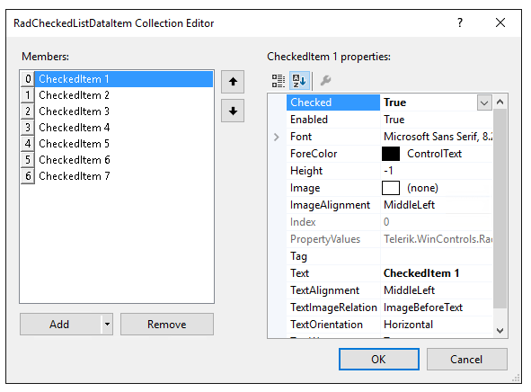
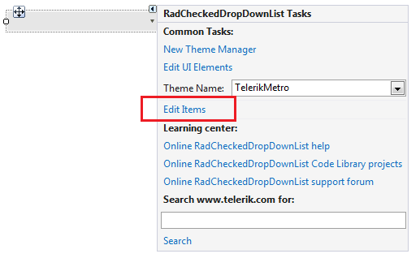
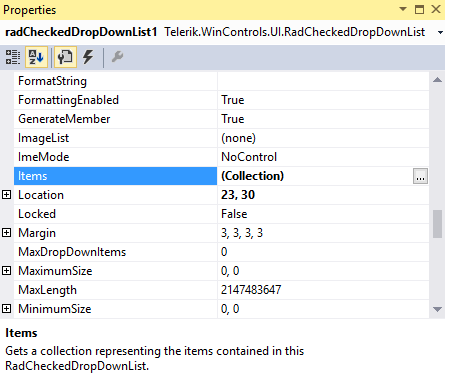
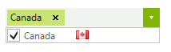
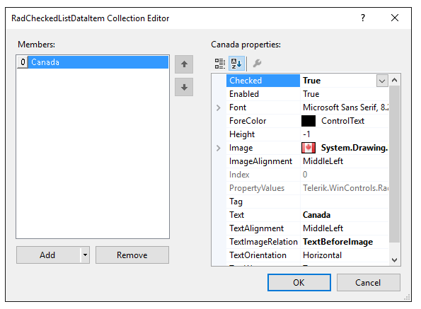
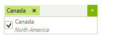
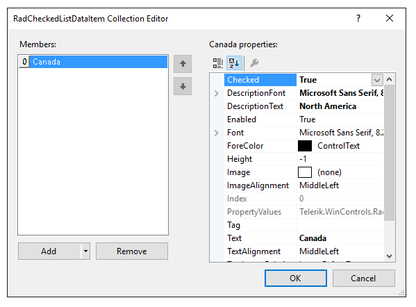

# Design time
 
This article demonstrates how to populate __RadCheckedDropDownList__ with data at design time. The *RadCheckedListDataItem Collection Editor* allows you to do that.

>caption Figure 1: RadCheckedListDataItem Collection Editor

You can access it through the *Smart tag >> Edit Items* option:

>caption Figure 2: Smart tag options

Another possibility to open the editor is via the __Items__ collection in the *Properties* Visual Studio section:

>caption Figure 3:  Visual Studio Properties window

You can add two item types:

* __RadCheckedListDataItem__ – it represents a logical data item which can display specific text, image and checkbox.You can customize its look through the *Properties* section on the right side of the item in the *RadCheckedListDataItem Collection Editor*.

>caption Figure 4: Sample RadCheckedListDataItem

Below you can find the properties associated with the __RadCheckedListDataItem__:

>caption Figure 5:  RadCheckedListDataItem's properties

* __DescriptionTextCheckedListDataItem__ – similar to the __RadCheckedListDataItem__. In addition, it displays some description below the item’s text.

>caption Figure 6:  Sample DescriptionTextCheckedListDataItem

You have two additional properties: __DescriptionFont__ and __DescriptionText__ which specifies the font and the text associated with the item’s description.

>caption Figure 7:  DescriptionTextCheckedListDataItem's properties

# See Also

* [Adding Items Programmatically]()
* [Data Binding]()
