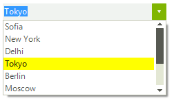
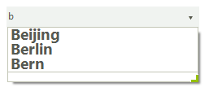

# Formatting Items
 
## Formatting drop down list items

Items appearance in __RadDropDownList__ can be customized by making use of the __VisualListItemFormatting__ event. The following example demonstrates how you can change the color of an item which is being selected.
        

>note By using this event to customize the items appearance, you should always provide an *else* clause, where you reset the appearance settings which you have introduced. This is necessary since __RadDropDownList__ uses data virtualization, which might lead to unpredicted appearance results when items are being reused.

>caption Figure 1: Formatting items in drop down

#### Customize selected item appearance 

<snippet id='dropdownlist-formatting-items-customizeitems-cs' />
<snippet id='dropdownlist-formatting-items-customizeitems-vb' />

## Customizing auto-complete drop-down appearance

In order to customize the auto complete pop-up, you should subscribe to the __VisualItemFormatting__ event of the __AutoCompleteSuggestHelper__. 

#### Subscribe to the VisualItemFormatting event of the auto complete popup

<snippet id='dropdownlist-formatting-items-event-cs' />
<snippet id='dropdownlist-formatting-items-event-vb' />

The following code snippet, will demonstrate how to change the Font of all items in the auto complete drop down.

#### Customize auto complete items appearance 

<snippet id='dropdownlist-formatting-items-customizeautocompletedropdown-cs' />
<snippet id='dropdownlist-formatting-items-customizeautocompletedropdown-vb' />

>note Here we do not reset the style because we do want the Font for all items to be changed not only on certain one.

>caption Figure 2: Formatting auto-complete items

