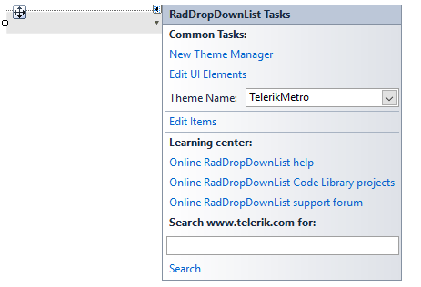
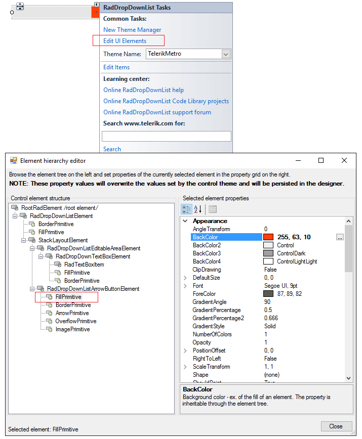

# Design Time

To start using __RadDropDownList__ just drag it from the toolbox and drop it at the form.
 
## Smart Tag

Select __RadDropDownList__ and click the small arrow on the top right position in order to open the __Smart Tag__. The __Smart Tag__ for __RadDropDownList__ lets you quickly access common tasks involved with building __RadDropDownList__ elements and customizing appearance through themes.

>caption Figure 1: Smart Tag

* __New Theme Manager__: adds a new __RadThemeManager__ component to the form.
            

* __Edit UI Elements__: allows setting properties at multiple levels of the class hierarchy.
            
>caption Figure 2: Element hierarchy editor

* __Theme Name__: select a theme name from the drop down list of themes available for that control. Selecting a theme allows you to change all aspects of the control's visual style at one time.
            

* __Edit Items__: allows populating the __RadDropDownList__ at design time. Additional information can be found in the [Populating with Data >> Design Time]() help article.
            

## Data Binding

You can bind __RadDropDownList__ at design time by specifying the __DataSource__, __ValueMember__ and __DisplayMember__ properties. Additional information can be found on the following link: [Data binding at design time]().
        
# See Also

* [Element Hierarchy Editor]()
* [Using default themes]()
