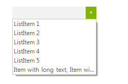
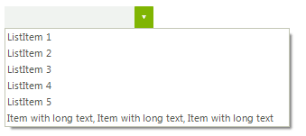

# DropDown Resizing

## DropDownSizingMode

__RadDropDownList__ supports different sizing modes, based on the __DropDownSizingMode__ property of the control.
      

The __SizingMode__ enumeration has the following members:
        

* __None__: no sizing is allowed.
            
>caption Figure 1: SizingMode.None

#### SizingMode.None 

<snippet id='dropdownlist-dropdown-resizing-none-cs' />
<snippet id='dropdownlist-dropdown-resizing-none-vb' />

 
* __RightBottom__: allows sizing in horizontal direction.
            
>caption Figure 2: SizingMode.RightBottom

#### SizingMode.RightBottom 

<snippet id='dropdownlist-dropdown-resizing-rightbottom-cs' />
<snippet id='dropdownlist-dropdown-resizing-rightbottom-vb' />

 

* __UpDown__: allows sizing in vertical direction.
            
>caption Figure 3: SizingMode.UpDown

#### SizingMode.UpDown 

<snippet id='dropdownlist-dropdown-resizing-updown-cs' />
<snippet id='dropdownlist-dropdown-resizing-updown-vb' />

 

* __UpDownAndRightBottom__: allows sizing in both directions.
            
>caption Figure 4: SizingMode.UpDownAndRightBottom

#### SizingMode.UpDownAndRightBottom 

<snippet id='dropdownlist-dropdown-resizing-updownandrightbottom-cs' />
<snippet id='dropdownlist-dropdown-resizing-updownandrightbottom-vb' />

 

## Fixed size

You can specify a fixed height or width of the drop-down by setting the __DropDownHeight__ and __DropDownWidth__ properties.
        
>caption Figure 5: DropDownHeight

#### DropDownHeight 

<snippet id='dropdownlist-dropdown-resizing-dropdownheight-cs' />
<snippet id='dropdownlist-dropdown-resizing-dropdownheight-vb' />

 
>caption Figure 6: DropDownWidth

#### DropDownWidth 

<snippet id='dropdownlist-dropdown-resizing-dropdownwidth-cs' />
<snippet id='dropdownlist-dropdown-resizing-dropdownwidth-vb' />

 

You can set the __DropDownMinSize__ property in order to specify the exact minimum height and width for the drop-down.
        
>caption Figure 7: DropDownMinSize

#### DropDownMinSize 

<snippet id='dropdownlist-dropdown-resizing-dropdownminsize-cs' />
<snippet id='dropdownlist-dropdown-resizing-dropdownminsize-vb' />

## Auto size

The following example demonstrates a sample approach how to handle the RadDropDownList.__PopupOpening__ event and achieve auto size functionality for the pop up in __RadDropDownList__:

#### Auto size drop down 

<snippet id='dropdownlist-dropdown-resizing-autosizedropdown-cs' />
<snippet id='dropdownlist-dropdown-resizing-autosizedropdown-vb' />

|Default pop up size|Auto sized popup|
|----|----|
|||

## Displayed items

By default, __RadDropDownList__ displays 6 items in the pop-up. In case you need to change this number you can set the __DefaultItemsCountInDropDown__ property:
      
>caption Figure 8: DefaultItemsCountInDropDown

#### DefaultItemsCountInDropDown 

<snippet id='dropdownlist-dropdown-resizing-defaultitemscountindropdown-cs' />
<snippet id='dropdownlist-dropdown-resizing-defaultitemscountindropdown-vb' />

