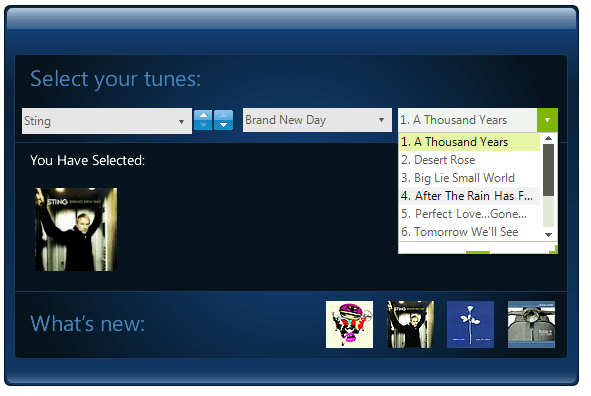

# DropDownList

__RadDropDownList__ is an enhanced alternative to the standard Windows Forms combo box control. __RadDropDownList__ can be [bound to data]() sources. It allows you to [replace] () its major components giving you control over its visual and data behavior. You can exercise control over the [scrolling logic](), the items layout and even the low level data binding logic by providing their own data layer.

You can review below the [Key Features](#key-features) that __RadDropDownList__ supports.





## Key Features

* __Auto-complete__: The control provides flexible [auto-completion]() options that suggest and  append text from choices in the list as the user types.  
* __Filtering__: RadDropDownList supports [filtering]() of its items. In order to apply a filter, you should set the __Filter__ property of __RadDropDownList__ to a predicate that will be called for every data item in order to determine if the item will be visible.
* __Scrolling__: In the scenatio where you cannot fit the __RadListDataItems__ in the popup, a vertical scroll bar will appear so that you can scroll down and select the desire item. You can see the different scrolling options [here.]()
* __Selection__: RadDropDownList supports three types of selection modes which you can wxplore in this [article.]()
* __Sorting__: You can control how the items in the __RadDropDownList__ are sorted by specifying the [SortStyle]() property.

>tip In the related [Getting Started](https://docs.telerik.com/devtools/winforms/controls/dropdown-listcontrol-and-checkeddropdownlist/dropdownlist/getting-started) article you can find how to use the control with a sample scenario.

> Download and check out the online demo at [demos.telerik.com](https://telerik-winforms-demos.s3.amazonaws.com/TelerikWinFormsExamplesLauncher.exe)

# See Also

* [Getting Started]()
* [Structure]()
* [Design Time]()
* [Properties, Methods and Events]()
* [Drop Down Style]()
* [Drop Down Resizing]()
* [Item Sizing]()
* [Animation Effects]()
